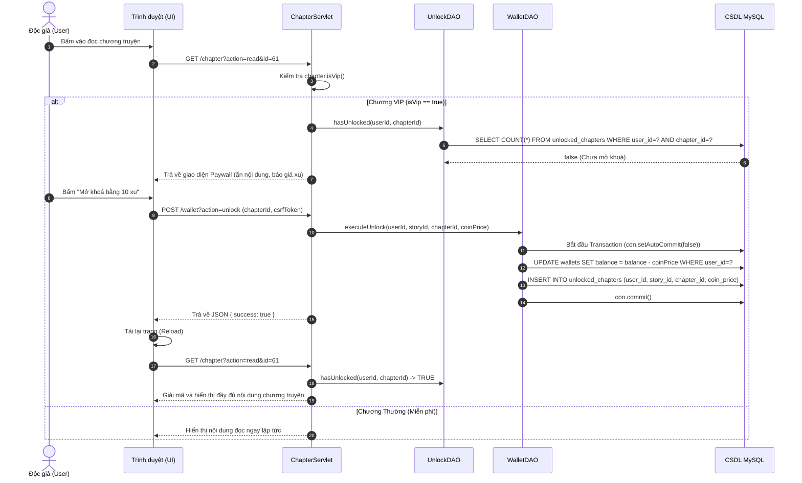
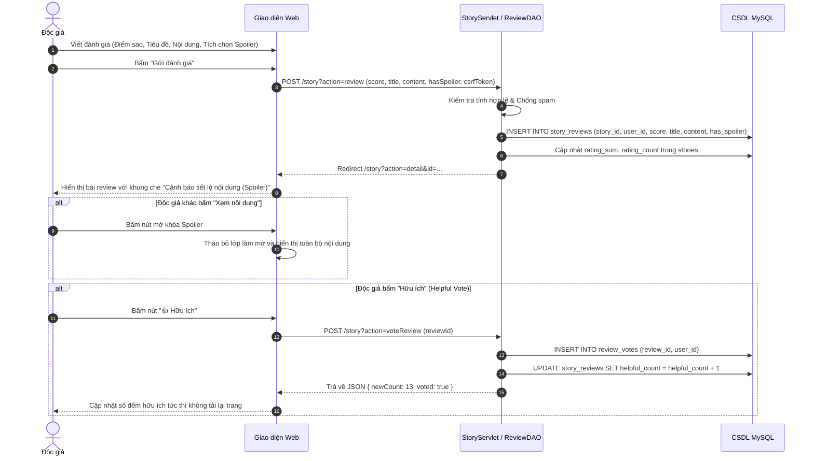
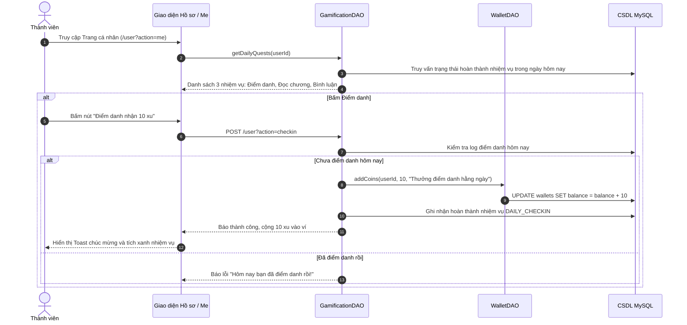
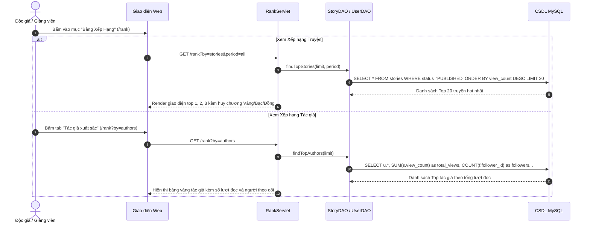
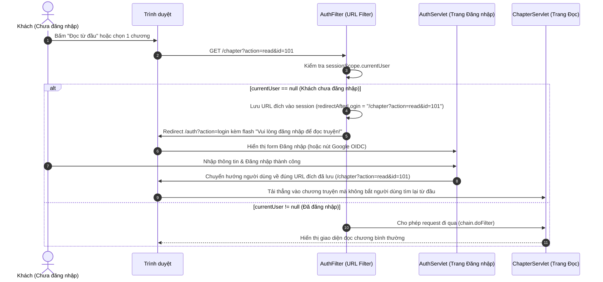
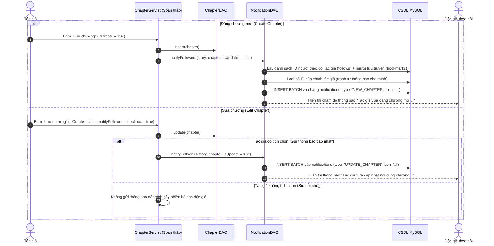

# 📚 TỔNG HỢP TOÀN BỘ HỆ THỐNG WEB ĐỌC TRUYỆN

> **Tài liệu tổng hợp kiến trúc, bản đồ trang, danh mục chức năng đầy đủ, sơ đồ tuần tự hệ thống (Sequence Diagrams) và 25 phân hệ nâng cao đã hoàn thiện.**  
> Cập nhật: 2026-10-05 · **Phiên bản:** Hoàn thiện 25 Module Công nghệ Nâng cao (ISSUE-001 → ISSUE-026) · **Độ phủ test:** 126/126 tests PASS (100%).

---

## 📑 MỤC LỤC
1. [Tổng quan Đồ án & Nền tảng Kỹ thuật](#1-tổng-quan-đồ-án--nền-tảng-kỹ-thuật)
2. [Đối chiếu Chức năng: Đề xuất Ban đầu vs Hệ thống Hiện tại](#2-đối-chiếu-chức-năng-đề-xuất-ban-đầu-vs-hệ-thống-hiện-tại)
3. [Bản đồ Hệ thống: 36 Trang Web & 7 Endpoints Dịch vụ](#3-bản-đồ-hệ-thống-36-trang-web--7-endpoints-dịch-vụ)
4. [Danh mục 45 Chức năng Toàn diện (Full Feature Catalog)](#4-danh-mục-45-chức-năng-toàn-diện-full-feature-catalog)
5. [Hệ thống 25 Module Công nghệ Nâng cao (ISSUE-001 → ISSUE-026)](#5-hệ-thống-25-module-công-nghệ-nâng-cao-issue-001--issue-026)
6. [Sơ đồ Tuần tự Hệ thống (Sequence Diagrams) & Kiểm soát Luồng Nghiệp vụ](#6-sơ-đồ-tuần-tự-hệ-thống-sequence-diagrams--kiểm-soát-luồng-nghiệp-vụ)
7. [Thiết kế Cơ sở Dữ liệu (18 Bảng CSDL)](#7-thiết-kế-cơ-sở-dữ-liệu-18-bảng-csdl)
8. [Kiến trúc CSS Phân tầng & Trải nghiệm Người dùng](#8-kiến-trúc-css-phân-tầng--trải-nghiệm-người-dùng)
9. [Bảo mật & Trợ năng (Security & Accessibility)](#9-bảo-mật--trợ-năng-security--accessibility)
10. [Hệ thống Kiểm thử Tự động (126 Tests 100% PASS)](#10-hệ-thống-kiểm-thử-tự-động-126-tests-100-pass)
11. [Hướng dẫn Vận hành Nhanh](#11-hướng-dẫn-vận-hành-nhanh)

---

## 1. Tổng quan Đồ án & Nền tảng Kỹ thuật

| Thành phần | Đặc tả kỹ thuật |
|---|---|
| **Tên đồ án** | Xây dựng website đọc truyện trực tuyến có quản lý nội dung và phân quyền người dùng |
| **Tên ứng dụng** | **ĐọcTruyện — Hi Tranquility** |
| **Mô hình kiến trúc** | **MVC Model 2 (Model – View – Controller)** thuần Java, Server-side Rendering (SSR) |
| **Công nghệ lõi** | Java Servlet 3.1, JSP 2.3, JSTL 1.2, HikariCP Connection Pool |
| **Cơ sở dữ liệu** | MySQL 8.0 (InnoDB, `utf8mb4_unicode_ci`, FULLTEXT Indexing) |
| **Máy chủ Web/App** | Apache Tomcat 9.0 (Embedded / Standalone) |
| **Frontend** | Vanilla CSS (Kiến trúc 4 tầng tinh gọn, Mobile 360px, Dark/Light Mode), Vanilla JS (PWA, Service Worker, FileReader) |
| **Tích hợp bên thứ 3** | Google OAuth / Firebase OIDC, Google reCAPTCHA v3, Google Drive API v3, JavaMail SMTP |
| **Quy mô mã nguồn** | **82 lớp Java**, **55 file JSP (36 trang nội dung, 5 layouts, 14 partials)**, **18 bảng CSDL**, **24 file test / 126 bài Unit Test** |

---

## 2. Đối chiếu Chức năng: Đề xuất Ban đầu vs Hệ thống Hiện tại

Trước đây, đồ án có các tài liệu mô tả chức năng ở từng giai đoạn:
- **`DANG-KY-DE-TAI.md`**: Bản đề xuất ban đầu đăng ký các tính năng cơ bản và 14 tính năng tuỳ chọn.
- **`MO-TA-DO-AN.md`**: Bản tóm tắt gửi giảng viên (ghi nhận 17 chức năng cốt lõi).
- **`ke-hoach-frontend.md`**: Bản quy hoạch ban đầu dự kiến 30 trang và 4 layouts.

Qua quá trình phát triển và hoàn thiện trọn vẹn **25 ISSUE công nghệ cao** (18 ISSUE đợt 1 + 7 ISSUE mở rộng đợt 2: ISSUE-020, ISSUE-021, ISSUE-022, ISSUE-024, ISSUE-025, ISSUE-026 và Chapter Notifications), hệ thống hiện tại đã mở rộng vượt bậc:

| Tiêu chí | Bản đăng ký / mô tả cũ | Hệ thống thực tế hiện tại | Tỉ lệ hoàn thành / Ghi chú |
|---|:---:|:---:|---|
| **Số lượng chức năng** | 17 – 28 chức năng | **45 chức năng hoàn chỉnh** | **Đạt 160%** (vượt xa toàn bộ yêu cầu cơ bản và tuỳ chọn ban đầu) |
| **Số lượng trang web (Views)** | 30 – 31 trang | **36 trang web JSP + 7 Endpoints** | Bổ sung Thống kê tác giả, Tìm kiếm FULLTEXT, Lỗi 403, Raw view, REST API, Drive Backup, Wallet, Gamification |
| **Khung bố cục (Layouts)** | 4 layouts | **5 layouts** (`main`, `auth`, `reader`, `admin`, `editor`) | Bổ sung layout `editor` chuyên biệt cho sáng tác chương truyện |
| **Số lớp mã nguồn Java** | 47 – 60 lớp | **82 lớp Java** | 19 Controllers, 17 DAOs, 15 Models, 6 Filters, 13 Utilities, 12 Services/Helpers |
| **Số file view JSP** | 50 – 51 files | **55 file JSP** | 36 trang nội dung, 5 layout wrappers, 14 view partials tái sử dụng |
| **Bảng dữ liệu CSDL** | 13 bảng | **18 bảng** | Bổ sung `wallets`, `transactions`, `report_evidence`, `unlocked_chapters`, `story_reviews`, `review_votes`, `user_quests` |
| **Bộ kiểm thử tự động** | 28 bài | **126 bài Unit Tests (24 classes)** | Đạt 100% PASS, kiểm thử toàn diện DAO, Filter, Token, Wallet, RateLimiter, Report, EpubWriter, VIP Unlock, Reviews, Gamification |

---

## 3. Bản đồ Hệ thống: 36 Trang Web & 7 Endpoints Dịch vụ

Ứng dụng vận hành với **5 khung Layout chuyên biệt**:
- `main.jsp`: Khung chính (Nav kính mờ + Shell nội dung + Footer thương hiệu)
- `auth.jsp`: Khung xác thực tối giản căn giữa màn hình (tập trung trải nghiệm đăng nhập/đăng ký)
- `reader.jsp`: Khung đọc truyện chuyên biệt (cột chữ 38em, font có chân, không phân tâm, tối ưu mỏi mắt)
- `admin.jsp`: Khung quản trị (Sidebar trái + Header điều hướng đa tác vụ)
- `editor.jsp`: Khung soạn thảo chương truyện tập trung (khung rộng, đếm số từ trực tiếp, phím tắt văn học)

### A. Nhóm Công cộng & Khám phá (Public & Discovery — 15 trang/endpoints)

| # | Trang web | URL truy cập | Layout | Controller | Mảnh JSP nội dung | Phân quyền |
|:-:|---|---|---|---|---|---|
| 1 | **Trang chủ** | `/` | `main` | `HomeServlet` | `common/home.jsp` | Tất cả |
| 2 | **Kho truyện & Bộ lọc thể loại** | `/story?action=list` | `main` | `StoryServlet` | `common/story/list.jsp` | Tất cả |
| 3 | **Tìm kiếm sâu nội dung chương** | `/story?action=search&q={q}` | `main` | `StoryServlet` | `common/story/search.jsp` | Tất cả |
| 4 | **Chi tiết truyện & Gợi ý truyện** | `/story?action=detail&id={id}` | `main` | `StoryServlet` | `common/story/detail.jsp` | Tất cả |
| 5 | **Đọc chương truyện** | `/chapter?action=read&id={id}` | `reader` | `ChapterServlet` | `common/chapter/read.jsp` | Thành viên (Auth Guard) |
| 6 | **Xem nội dung chương thô (Raw)** | `/chapter?action=raw&id={id}` | *Raw* | `ChapterServlet` | `common/chapter/raw.jsp` | Thành viên (Auth Guard) |
| 7 | **Bảng xếp hạng (Truyện & Tác giả)** | `/rank` hoặc `/rank?by=authors` | `main` | `RankServlet` | `common/rank.jsp` | Tất cả |
| 8 | **Hướng dẫn sử dụng website** | `/page?name=guide` | `main` | `PageServlet` | `common/page/guide.jsp` | Tất cả |
| 9 | **Nội quy cộng đồng & Tiêu chuẩn** | `/page?name=rules` | `main` | `PageServlet` | `common/page/rules.jsp` | Tất cả |
| 10 | **Hồ sơ tác giả công khai** | `/user?action=profile&id={id}` | `main` | `UserServlet` | `user/profile.jsp` | Tất cả |
| 11 | **Tải truyện Offline (.txt)** | `/download?storyId={id}` | *Raw Text* | `DownloadServlet` | *Stream trực tiếp* | Thành viên (Auth Guard) |
| 12 | **Sơ đồ trang SEO (XML Sitemap)** | `/sitemap.xml` | *XML* | `SitemapServlet` | *Stream XML* | Bot tìm kiếm |
| 13 | **Tệp chỉ dẫn Robots** | `/robots.txt` | *Text* | Static | `webapp/robots.txt` | Bot tìm kiếm |
| 14 | **Báo lỗi 403 (Truy cập bị từ chối)**| `/error?code=403` | `main` | `ErrorServlet` | `error/403.jsp` | Tất cả |
| 15 | **Báo lỗi 404 (Không tìm thấy trang)** | `/error?code=404` | `main` | `ErrorServlet` | `error/404.jsp` | Tất cả |
| 16 | **Báo lỗi 500 (Lỗi máy chủ nội bộ)** | `/error?code=500` | `main` | `ErrorServlet` | `error/500.jsp` | Tất cả |

### B. Nhóm Xác thực & Tài khoản (Authentication — 4 trang)

| # | Trang web | URL truy cập | Layout | Controller | Mảnh JSP nội dung | Phân quyền |
|:-:|---|---|---|---|---|---|
| 17 | **Đăng nhập (Mật khẩu & Google OIDC)** | `/auth?action=login` | `auth` | `AuthServlet` | `auth/login.jsp` | Khách |
| 18 | **Đăng ký thành viên (+ reCAPTCHA)** | `/auth?action=register` | `auth` | `AuthServlet` | `auth/register.jsp` | Khách |
| 19 | **Quên mật khẩu (Gửi email SMTP)** | `/auth?action=forgot` | `auth` | `AuthServlet` | `auth/forgot.jsp` | Khách |
| 20 | **Đặt lại mật khẩu (Token bảo mật)** | `/auth?action=reset&token={token}` | `auth` | `AuthServlet` | `auth/reset.jsp` | Khách |

### C. Nhóm Thành viên & Độc giả (Member & Reader Experience — 8 trang)

| # | Trang web | URL truy cập | Layout | Controller | Mảnh JSP nội dung | Phân quyền |
|:-:|---|---|---|---|---|---|
| 21 | **Trung tâm cá nhân (Hồ sơ & Ví xu)** | `/user?action=me` | `main` | `UserServlet` | `user/me.jsp` | Thành viên |
| 22 | **Chỉnh sửa hồ sơ (+ Unlink Guard)** | `/user?action=edit` | `main` | `UserServlet` | `user/edit.jsp` | Thành viên |
| 23 | **Đổi mật khẩu tài khoản** | `/user?action=password` | `main` | `UserServlet` | `user/edit.jsp` | Thành viên |
| 24 | **Truyện đã lưu (Bookmarks & Tiến độ)** | `/bookmark?action=list` | `main` | `BookmarkServlet` | `user/bookmarks.jsp` | Thành viên |
| 25 | **Lịch sử đọc truyện cá nhân** | `/history` | `main` | `HistoryServlet` | `user/history.jsp` | Thành viên |
| 26 | **Tác giả đang theo dõi (Following)** | `/follow?action=list` | `main` | `FollowServlet` | `user/following.jsp` | Thành viên |
| 27 | **Hộp thông báo cá nhân** | `/notification?action=list` | `main` | `NotificationServlet` | `user/notifications.jsp` | Thành viên |
| 28 | **Gửi báo cáo vi phạm nội dung** | `/report?action=create` | `main` | `ReportServlet` | `user/report.jsp` | Thành viên |

### D. Nhóm Tác giả & Sáng tác (Author Studio — 5 trang/endpoints)

| # | Trang web | URL truy cập | Layout | Controller | Mảnh JSP nội dung | Phân quyền |
|:-:|---|---|---|---|---|---|
| 29 | **Tủ truyện của tôi (Author Bookshelf)**| `/story?action=mine` | `main` | `StoryServlet` | `user/story/mine.jsp` | Tác giả / Admin |
| 30 | **Đăng / Sửa truyện (+ Live Preview)** | `/story?action=create` hoặc `edit` | `main` | `StoryServlet` | `user/story/form.jsp` | Tác giả / Admin |
| 31 | **Thống kê truyện (Biểu đồ 14 ngày)** | `/story?action=stats` | `main` | `StoryServlet` | `user/story/stats.jsp` | Tác giả / Admin |
| 32 | **Soạn thảo / Sửa chương truyện** | `/chapter?action=create` hoặc `edit` | `editor` | `ChapterServlet` | `user/chapter/form.jsp` | Tác giả / Admin |
| 33 | **Sao lưu truyện sang Google Drive** | `/backup/drive?storyId={id}` | *Raw/Redirect* | `DriveBackupServlet` | *OAuth v3 API* | Tác giả / Admin |

### E. Nhóm Quản trị viên (Admin Dashboard — 6 trang)

| # | Trang web | URL truy cập | Layout | Controller | Mảnh JSP nội dung | Phân quyền |
|:-:|---|---|---|---|---|---|
| 34 | **Bảng điều khiển & Thống kê tổng quan**| `/admin/dashboard` | `admin` | `AdminDashboardServlet` | `admin/dashboard.jsp` | Quản trị viên |
| 35 | **Quản lý toàn bộ kho truyện (Xóa mềm)**| `/admin/story` | `admin` | `AdminStoryServlet` | `admin/stories.jsp` | Quản trị viên |
| 36 | **Quản lý tài khoản & Khóa người dùng**| `/admin/user` | `admin` | `AdminUserServlet` | `admin/users.jsp` | Quản trị viên |
| 37 | **Quản lý danh mục thể loại (Tags)** | `/admin/tag` | `admin` | `AdminTagServlet` | `admin/tags.jsp` | Quản trị viên |
| 38 | **Xử lý báo cáo vi phạm từ người dùng** | `/admin/report` | `admin` | `AdminReportServlet` | `admin/reports.jsp` | Quản trị viên |
| 39 | **Kiểm duyệt & Ẩn bình luận vi phạm** | `/admin/comment` | `admin` | `AdminCommentServlet` | `admin/comments.jsp` | Quản trị viên |

### F. Nhóm RESTful JSON API & Dịch vụ Ngoại tuyến (API, PWA & Endpoints — 7 endpoints)

| # | Endpoint dịch vụ | Giao thức | Controller / File | Vai trò & Mục đích | Phân quyền |
|:-:|---|---|---|---|---|
| 40 | `/api/stories` | GET (JSON) | `ApiServlet` | Cung cấp danh sách truyện hỗ trợ phân trang & CORS | Tất cả |
| 41 | `/api/story/{id}` | GET (JSON) | `ApiServlet` | Cung cấp chi tiết truyện và danh sách mục lục chương | Tất cả |
| 42 | `/api/chapter/{id}` | GET (JSON) | `ApiServlet` | Cung cấp toàn bộ nội dung chương đọc cho client/app | Tất cả |
| 43 | `/wallet?action=balance` / `tip` | GET / POST | `WalletServlet` | API kiểm tra số dư và chuyển xu ảo tặng tác giả (ACID) | Thành viên |
| 44 | `/wallet?action=unlock` | POST | `WalletServlet` | API mở khóa chương VIP bằng xu ảo (ISSUE-020) | Thành viên |
| 45 | `/manifest.json` & `/sw.js` | Static / JS | Service Worker | Quản lý cache PWA, cho phép cài HomeScreen & đọc offline | Tất cả |

---

## 4. Danh mục 45 Chức năng Toàn diện (Full Feature Catalog)

Hệ thống được thiết kế hoàn thiện với **45 chức năng phân thành 5 nhóm đối tượng**:

### Phân hệ 1: Chức năng cho Khách & Độc giả (11 chức năng)
1. **Khám phá Trang chủ đa chiều:** Hiển thị truyện mới cập nhật, truyện đọc nhiều nhất, truyện có đánh giá cao nhất, và khối "Tiếp tục đọc" cho người dùng quay lại.
2. **Duyệt & Lọc kho truyện nâng cao:** Lọc theo 10+ danh mục thể loại, lọc trạng thái (Đang tiến hành / Đã hoàn thành), sắp xếp theo độ phổ biến / mới cập nhật, phân trang chuẩn mực.
3. **Tìm kiếm sâu trong nội dung chương (ISSUE-005):** Tìm kiếm FULLTEXT xuyên suốt hàng trăm ngàn từ của các chương truyện, trích đoạn ngữ cảnh chứa từ khóa kèm highlight `<mark>`.
4. **Xem chi tiết truyện:** Xem ảnh bìa, tóm tắt nội dung, danh sách tác giả, thể loại liên quan, danh sách mục lục chương, thống kê lượt đọc / lượt lưu.
5. **Chặn đọc khi chưa đăng nhập (Auth Guard Enforce):** Nhấp đọc chương khi chưa đăng nhập sẽ tự động điều hướng sang trang Đăng nhập và tự động quay lại đúng chương đọc sau khi vào tài khoản thành công.
6. **Đọc chương với Reader chuyên biệt:** Tự động ẩn thanh điều hướng, độ rộng cột tối ưu thị giác chống mỏi mắt (38em), điều hướng nhanh bằng phím mũi tên `←` / `→`, mục lục chương dạng popup thả xuống.
7. **Tùy biến môi trường đọc:** Chuyển đổi Dark Mode / Light Mode / Sepia, tăng giảm cỡ chữ (A- / A+), giãn dòng, lựa chọn font chữ có chân (Serif) hoặc không chân (Sans-serif).
8. **Tự động lưu tiến độ đọc:** Không cần bấm lưu, hệ thống tự động ghi nhận chương đang đọc và vị trí % thanh cuộn vào CSDL và LocalStorage.
9. **Tải truyện Offline (.txt):** Cho phép xuất và tải toàn bộ truyện về máy tính/điện thoại để đọc khi không có mạng.
10. **Bảng xếp hạng (Truyện & Tác giả - ISSUE-006):** Xếp hạng truyện theo lượt xem / điểm đánh giá; Bảng vàng vinh danh các tác giả xuất sắc nhất kèm số lượt đọc và người theo dõi.
11. **Trang thông tin & Trợ năng:** Xem Hướng dẫn sử dụng (`/page?name=guide`), Nội quy cộng đồng (`/page?name=rules`), hỗ trợ phím tắt A11y, Skip-link và Mobile chạm chuẩn 44px (ISSUE-015).

### Phân hệ 2: Chức năng cho Thành viên & Độc giả có Tài khoản (11 chức năng)
12. **Xác thực tài khoản đa phương thức:** Đăng ký, đăng nhập bằng tài khoản nội bộ (mật khẩu băm PBKDF2 muối ngẫu nhiên), hoặc đăng nhập 1 chạm an toàn bằng Google OIDC qua Firebase (ISSUE-001).
13. **Quản lý Hồ sơ & Unlink Guard:** Cập nhật thông tin cá nhân (tên hiển thị, tiểu sử bio, avatar). Cơ chế Unlink Guard bắt buộc phải có mật khẩu trước khi cho phép gỡ liên kết Google.
14. **Khôi phục mật khẩu qua Email thật (ISSUE-002):** Gửi email đặt lại mật khẩu với token mã hóa thời hạn 30 phút qua giao thức JavaMail SMTP bất đồng bộ.
15. **Tủ truyện đã lưu (Bookmarks):** Quản lý danh sách các truyện yêu thích, hiển thị tiến độ đọc và nút "Đọc tiếp" nhảy thẳng tới chương đang dở. Nút "Lưu truyện" hiển thị rõ ràng trên mọi giao diện.
16. **Lịch sử đọc truyện (Reading History):** Xem lại toàn bộ các chương đã đọc theo trình tự thời gian, hỗ trợ xóa từng mục hoặc làm sạch lịch sử.
17. **Bình luận đa cấp & Thảo luận theo chương (ISSUE-004):** Bình luận ở chân trang chi tiết truyện hoặc bình luận chuyên sâu dưới chân từng chương đọc; hỗ trợ trả lời lồng nhau (nested comments) và thả tim tương tác.
18. **Chấm sao đánh giá (Rating):** Chấm sao từ 1 đến 5 sao với cơ chế chống gian lận (khóa chính kép `user_id, story_id`, mỗi tài khoản chỉ đánh giá 1 lần).
19. **Đánh giá chuyên sâu kèm Thẻ Spoiler (ISSUE-022):** Viết bài phân tích tác phẩm có tiêu đề, nội dung và tùy chọn đánh dấu Spoiler. Độc giả khác có thể bình chọn Hữu ích / Không hữu ích (Helpful votes).
20. **Mở khóa Chương VIP bằng Xu (ISSUE-020):** Mở khóa chương VIP bằng số dư xu trong ví ảo; nội dung sau khi mở được giải mã và lưu quyền truy cập vĩnh viễn trong CSDL.
21. **Trò chơi hóa (Gamification) & Điểm danh hằng ngày (ISSUE-026):** Điểm danh nhận 10 xu mỗi ngày, hoàn thành 3 nhiệm vụ hằng ngày (Điểm danh, Đọc chương, Bình luận/Đánh giá) và thăng cấp huy hiệu.
22. **Gửi Báo cáo vi phạm (Report):** Gửi phản ánh nội dung truyện hoặc bình luận có dấu hiệu vi phạm để ban quản trị kiểm duyệt (ISSUE-025).

### Phân hệ 3: Chức năng cho Tác giả & Sáng tác — Author Studio (8 chức năng)
23. **Tủ truyện tác giả (My Stories):** Quản lý danh sách các tác phẩm do chính mình sáng tác, phân loại truyện Đang ra / Hoàn thành / Bản nháp.
24. **Đăng & Chỉnh sửa truyện (+ Live Preview - ISSUE-017):** Khung tạo truyện đa thể loại, tải ảnh bìa trực tiếp từ máy với khung xem trước tỉ lệ 3:4 tức thì qua FileReader API, bảo toàn thể loại đã chọn khi gặp lỗi nhập liệu.
25. **Cấu hình Chương VIP & Giá Xu (ISSUE-020):** Tác giả chủ động bật/tắt quyền VIP và đặt giá xu mở khóa (1 – 10.000 xu) cho từng chương ngay tại màn hình soạn thảo.
26. **Soạn thảo chương với Layout Editor:** Giao diện tập trung toàn màn hình, thanh công cụ văn học (Gạch đầu dòng thoại, Phân đoạn hoa thị, Lời nhắn tác giả, Thụt lề, Làm sạch văn bản), tự động đếm từ và số phút đọc theo thời gian thực.
27. **Tùy chọn Bắn thông báo Cập nhật Chương:** Khi sửa đổi chương truyện, tác giả có thể chủ động tích chọn gửi thông báo cập nhật tới toàn bộ người theo dõi bộ truyện nếu có bổ sung tình tiết mới quan trọng.
28. **Bảng Thống kê truyện của tác giả:** Thống kê chi tiết tổng lượt xem, số lượt bookmark, số bình luận; kèm biểu đồ trực quan lượt đọc 14 ngày gần nhất của truyện nổi bật.
29. **Sao lưu Google Drive (Drive Backup - ISSUE-001):** Tác giả xuất bản sao lưu toàn bộ chương truyện lên Google Drive cá nhân dưới định dạng `001 - <chương>.txt` chuẩn hóa qua Drive API v3.
30. **Nhận xu ủng hộ & Tặng quà tác giả (ISSUE-008):** Độc giả có thể gửi tặng xu ảo kèm lời nhắn động viên cho tác giả; tác giả xem số dư xu trong ví cá nhân.

### Phân hệ 4: Chức năng cho Quản trị viên — Admin Dashboard (6 chức năng)
31. **Bảng điều khiển quản trị (Dashboard Analytics):** Thống kê tổng số truyện, số chương, số tài khoản, tổng lượt đọc, biểu đồ tăng trưởng 14 ngày và danh sách truyện hot nhất.
32. **Quản lý toàn bộ kho truyện (Xóa mềm):** Xem toàn bộ truyện trong hệ thống kể cả bản nháp; thực hiện gỡ truyện vi phạm hoặc khôi phục lại truyện đã gỡ mà không làm mất dữ liệu liên quan.
33. **Quản lý tài khoản người dùng:** Tra cứu thành viên, nâng/hạ quyền Quản trị viên, thực hiện khóa tài khoản kèm lý do vi phạm chi tiết và mở khóa tài khoản.
34. **Quản lý danh mục thể loại (Tags):** Thêm mới thể loại, sửa tên / slug thể loại, xóa thể loại, theo dõi số lượng truyện thuộc từng thể loại.
35. **Xử lý báo cáo vi phạm (Reports - ISSUE-025):** Tiếp nhận danh sách tố cáo từ độc giả, xem ảnh bằng chứng đính kèm, liên kết sâu nhảy thẳng tới nội dung bị báo cáo, đánh dấu Đã xử lý hoặc Bỏ qua.
36. **Kiểm duyệt bình luận:** Xem danh sách bình luận mới nhất, ẩn bình luận vi phạm (vẫn lưu lại bằng chứng trong CSDL) hoặc gỡ bỏ hoàn toàn.

### Phân hệ 5: Phân hệ Nền tảng, Tích hợp & Dịch vụ Nâng cao (9 chức năng)
37. **Ví xu ảo & Giao dịch nguyên tử (ACID Wallet - ISSUE-008):** Hệ thống ví xu nội bộ, ghi nhật ký giao dịch chuyển xu không thể xảy ra tình trạng mất mát dữ liệu tài chính.
38. **Bộ RESTful JSON API Chuẩn Quốc tế (ISSUE-009):** Cung cấp các endpoints chuẩn hóa kèm CORS headers cho bên thứ ba hoặc ứng dụng di động trong tương lai.
39. **PWA & Khả năng Đọc ngoại tuyến (Offline Reader - ISSUE-010):** Đạt chuẩn Progressive Web App, cho phép cài đặt app ra màn hình chính, Service Worker lưu bộ nhớ đệm giúp đọc lại các chương cũ không cần internet.
40. **Bảo vệ Sliding Window & Chống Brute-force/Spam (ISSUE-003):** Cơ chế Rate Limiter luồng an toàn tự động khóa tạm thời các IP/tài khoản cố tình thử mật khẩu hoặc spam bình luận.
41. **Tự động dọn dẹp hệ thống ngầm (Background Cleaner - ISSUE-013):** Daemon thread dọn dẹp nhật ký lượt đọc `view_logs` quá hạn 90 ngày, đảm bảo CSDL luôn tinh gọn.
42. **SEO Động, Sitemap & OpenGraph (ISSUE-012):** Tự động sinh `sitemap.xml`, cung cấp `robots.txt` và các thẻ OpenGraph (`og:image`, `og:title`) khi chia sẻ link lên Facebook/Zalo/Twitter.
43. **Chia sẻ 1 chạm & Toast Notifications (ISSUE-018):** Sao chép đường dẫn truyện vào Clipboard tức thì kèm Toast thông báo nổi siêu mượt.
44. **Xuất truyện chuẩn EPUB 2.0 (ISSUE-021):** Xuất toàn bộ truyện ra file `.epub` chuẩn quốc tế (đọc mượt trên Apple Books, Kindle, Moon+ Reader) với đầy đủ bìa sách, mục lục điều hướng NCX, phân chia chương XHTML 1.1 nghiêm ngặt và typography thanh lịch.
45. **Tách biệt Frontend Javascript & Tối ưu Cache (ISSUE-024):** Tách 188 dòng mã JavaScript khỏi `nav.jsp` sang file độc lập `assets/js/nav.js` tải qua thuộc tính `defer`, truyền ngữ cảnh qua `data-ctx`, giảm kích thước HTML tải về trên toàn bộ các trang và hỗ trợ browser cache.

---

## 5. Hệ thống 25 Module Công nghệ Nâng cao (ISSUE-001 → ISSUE-026)

Dự án đã giải quyết trọn vẹn lộ trình 25 Module Công nghệ nâng cao:

| Mã | Tên Module Nâng cao | Điểm sáng kỹ thuật |
|---|---|---|
| **ISSUE-001** | **Tích hợp Google Toàn diện** | Xác thực `idToken` Google OIDC ở backend; Bảo vệ tài khoản Unlink Guard (phải có mật khẩu mới cho gỡ Google); reCAPTCHA v3; Sao lưu truyện lên Google Drive API v3. |
| **ISSUE-002** | **Gửi Email SMTP Thật (JavaMail)** | Tích hợp thư viện JavaMail, gửi email đặt lại mật khẩu với giao diện HTML thương hiệu sang trọng. Hỗ trợ gửi bất đồng bộ qua hàng đợi và chế độ mô phỏng an toàn (Dev Simulation). |
| **ISSUE-003** | **Chặn Dò Mật khẩu & Spam** | Thuật toán cửa sổ trượt (Sliding Window in-memory) luồng an toàn: Tự động khóa IP/tài khoản 15 phút sau 5 lần thử sai; Cooldown 20 giây giữa các lượt bình luận. |
| **ISSUE-004** | **Bình luận theo từng Chương** | Mở rộng CSDL với `chapter_id`, nạp danh sách thảo luận chân chương, liên kết bình luận cha-con mượt mà không tải lại trang. |
| **ISSUE-005** | **Tìm kiếm Sâu trong Nội dung Chương** | Chỉ mục `FULLTEXT (title, content)` trong MySQL. Tự động trích xuất ngữ cảnh xung quanh từ khóa và bôi đậm (`<mark>`) trước khi hiển thị. |
| **ISSUE-006** | **Trang Tác giả & Bảng Xếp hạng Tác giả** | Trang hồ sơ công khai `/user?action=profile&id={id}`, thống kê tổng lượt đọc mọi truyện, số người theo dõi. Bổ sung tab xếp hạng tác giả xuất sắc `/rank?by=authors`. |
| **ISSUE-007** | **Gợi ý Truyện Thông minh** | Thuật toán lai ghép (Hybrid Recommendation): Gợi ý cùng thể loại kết hợp Lọc cộng tác (Collaborative Filtering: *"Người đọc truyện này cũng đọc"*). |
| **ISSUE-008** | **Ví Xu Ảo & Tặng thưởng Tác giả** | Bảng `wallets` và `transactions`. Cơ chế giao dịch nguyên tử (ACID Transaction) chuyển xu ảo ủng hộ tác giả, gửi tặng hoa, nạp xu trải nghiệm. |
| **ISSUE-009** | **RESTful JSON API Chuẩn Quốc tế** | Cung cấp endpoints `/api/stories`, `/api/story/{id}`, `/api/chapter/{id}` với CORS Headers đầy đủ, phục vụ ứng dụng di động hoặc bên thứ ba. |
| **ISSUE-010** | **PWA & Khả năng Đọc Ngoại tuyến** | Web App Manifest đạt chuẩn cài đặt HomeScreen; Service Worker chiến lược Cache-First cho tài nguyên tĩnh và nội dung chương đã mở. |
| **ISSUE-011** | **Kiến trúc CSS Phân tầng Tinh gọn** | Phân tầng 4 lớp: `base.css` (biến màu, reset) → `components.css` (thành phần chung) → `layout-*.css` (chuyên biệt cho Auth, Reader, Admin) → `pageCss`. Tiết kiệm băng thông tải trang. |
| **ISSUE-012** | **SEO Động, Sitemap & OpenGraph** | Tự động sinh `sitemap.xml` theo chuẩn sitemaps.org; Cung cấp `robots.txt`; Tự động sinh thẻ `og:title`, `og:image`, `og:description` khi chia sẻ lên MXH. |
| **ISSUE-013** | **Dọn dẹp `view_logs` Định kỳ** | Background thread chạy ngầm lúc khởi động máy chủ (AppListener), tự động dọn dẹp các dòng log vô danh quá 90 ngày, bảo vệ hiệu năng CSDL. |
| **ISSUE-014** | **Nâng Độ phủ Test Toàn diện** | Mở rộng bộ kiểm thử tự động lên 126 bài test, bao phủ toàn bộ các DAO nghiệp vụ, Servlets, Filters và các trường hợp biên. |
| **ISSUE-015** | **Trải nghiệm Mobile 360px & Trợ năng A11y** | Hoàn thiện layout cho màn hình từ 360px; Vùng chạm ngón tay tối thiểu 44px (chuẩn WCAG 2.1); Hỗ trợ `:focus-visible`, `.skip-link` và tôn trọng `prefers-reduced-motion`. |
| **ISSUE-016** | **Trang Báo lỗi 404 & 500 Tùy biến** | Bắt lỗi tập trung qua `ErrorServlet`, giao diện đồng bộ phong cách truyện, che giấu stack trace nhạy cảm của máy chủ. |
| **ISSUE-017** | **Live Preview Ảnh Bìa Truyện** | Khung xem trước bìa sách 3:4 trực quan khi người dùng chọn ảnh từ máy tính trước khi bấm lưu. |
| **ISSUE-018** | **Tiện ích Chia sẻ Truyện 1 Chạm** | Nút sao chép liên kết truyện vào clipboard kèm Toast thông báo nổi tức thì; Phím tắt chia sẻ Facebook/Twitter nhanh chóng. |
| **ISSUE-020** | **Chương VIP & Paywall Mở Khóa Bằng Xu** | Cho phép tác giả cấu hình chương VIP và mức giá xu; Paywall che nội dung với người chưa mở khoá; Giao dịch mở khóa an toàn trừ xu ACID; Lưu quyền sở hữu vào bảng `unlocked_chapters`. |
| **ISSUE-021** | **Xuất truyện ra EPUB 2.0 Chuẩn** | Dùng thuần `java.util.zip` của JDK; cấu trúc chuẩn EPUB 2.0 (mimetype STORED, container.xml, content.opf, toc.ncx, XHTML 1.1 escape XML chuẩn); đọc mượt trên Apple Books, Kindle, Moon+ Reader. |
| **ISSUE-022** | **Đánh Giá Chuyên Sâu & Cảnh Báo Spoiler** | Đánh giá chi tiết (Reviews) kèm tiêu đề, nội dung và thẻ Spoiler che nội dung nhạy cảm; Hệ thống vote hữu ích (Helpful votes); Chống spam đánh giá. |
| **ISSUE-024** | **Tách JS ra khỏi JSP & Browser Cache** | Tách JavaScript trong `nav.jsp` sang file `assets/js/nav.js` nạp với `defer`, đọc contextPath qua `data-ctx` trên `<body>`, hỗ trợ HTTP 304 disk cache và dọn đường cho CSP. |
| **ISSUE-025** | **Nâng cấp Báo cáo Vi phạm Toàn diện** | 8 loại vi phạm có phân loại, đính kèm tối đa 3 ảnh bằng chứng (chỉ admin xem), liên kết sâu nhảy thẳng tới nội dung bị báo cáo, bảng `report_evidence`. |
| **ISSUE-026** | **Trò Chơi Hóa (Gamification) & Nhiệm Vụ** | Điểm danh nhận xu hằng ngày (10 xu/ngày), hệ thống 3 nhiệm vụ ngày (Điểm danh, Đọc chương, Viết đánh giá), thanh tiến độ và danh hiệu độc giả. |
| **NOTIF-001** | **Hệ Thống Thông Báo Đa Kênh Tác Giả** | Tự động bắn thông báo khi đăng chương mới đến cả người theo dõi tác giả và người đã lưu truyện; Hỗ trợ tùy chọn bắn thông báo khi sửa chương quan trọng; Phân loại icon rõ ràng (`📖`, `📝`, `💬`, `🔔`). |

---

## 6. Sơ đồ Tuần tự Hệ thống (Sequence Diagrams) & Kiểm soát Luồng Nghiệp vụ

Để phục vụ thuyết minh đồ án và báo cáo kỹ thuật, hệ thống đã chuẩn hóa các sơ đồ tuần tự chi tiết mô tả luồng giao tiếp giữa Độc giả/Tác giả (Client/Browser), Servlet Controller, Filter/Security, DAO Model và Cơ sở dữ liệu MySQL:

### Sơ đồ 1: Luồng Mở Khóa Chương VIP (VIP Chapter Paywall Flow)
*Tác giả cấu hình chương VIP, độc giả truy cập gặp màn hình chặn Paywall, xác nhận mở khóa bằng số dư Ví xu và hệ thống ghi nhận giao dịch ACID.*



> 🖼️ *File sơ đồ xuất bản kèm theo:* `diagram_seq_vip.png`

---

### Sơ đồ 2: Luồng Đánh Giá Chuyên Sâu & Cảnh Báo Spoiler (Story Review System)
*Độc giả gửi bài đánh giá có tiêu đề, nội dung và tùy chọn Spoiler; độc giả khác xem bài đánh giá và bấm bình chọn Hữu ích.*



> 🖼️ *File sơ đồ xuất bản kèm theo:* `diagram_seq_review.png`

---

### Sơ đồ 3: Luồng Trò Chơi Hóa & Nhiệm Vụ Hằng Ngày (Gamification Flow)
*Cơ chế điểm danh nhận 10 xu mỗi ngày, hệ thống theo dõi 3 nhiệm vụ ngày và tự động cấp thưởng.*



> 🖼️ *File sơ đồ xuất bản kèm theo:* `diagram_seq_gamification.png`

---

### Sơ đồ 4: Luồng Bảng Xếp Hạng & Vinh Danh Tác Giả (Ranking Calculation)
*Thống kê và tính điểm bảng xếp hạng truyện nổi bật và tác giả xuất sắc dựa trên lượt xem, đánh giá và người theo dõi.*



> 🖼️ *File sơ đồ xuất bản kèm theo:* `diagram_seq_rank.png`

---

### Sơ đồ 5: Luồng Bắt Buộc Đăng Nhập Khi Đọc Truyện (Reader Auth Guard Flow)
*Rà soát tính hợp lý nghiệp vụ: Độc giả phải đăng nhập để đọc chương, bảo vệ bản quyền tác giả và giữ chân người dùng.*



---

### Sơ đồ 6: Luồng Thông Báo Tác Giả Xuất Bản & Cập Nhật Chương Truyện
*Quy chuẩn gửi thông báo: Báo đến đúng đối tượng theo dõi truyện và tác giả; phân biệt rõ đăng mới vs cập nhật sửa đổi.*



---

## 7. Thiết kế Cơ sở Dữ liệu (18 Bảng CSDL)

Database: `webdoctruyen` (Charset: `utf8mb4`, Collate: `utf8mb4_unicode_ci`, Storage Engine: `InnoDB`)

```text
[users] ───────────────┬──────────────────────┬──────────────────────┐
  │ 1                  │ 1                    │ 1                    │ 1
  ▼ N                  ▼ N                    ▼ N                    ▼ N
[stories]          [user_identities]      [wallets]              [user_quests]
  │ 1                  (Google OIDC)          (Ví xu ảo)             (Gamification)
  ├────────────────┬───────────────────┬──────────────┐
  ▼ N              ▼ N                 ▼ N            ▼ N
[chapters]     [story_tags]        [bookmarks]    [story_reviews]
  │ 1              (N-N tags)          │              │ 1
  ├──────────────┐                     │              ▼ N
  ▼ N            ▼ N                   │          [review_votes]
[comments]   [unlocked_chapters] ◄─────┘
               (Chương VIP mở khoá)
```

### Danh mục 18 Bảng Chi Tiết:
1. **`users`**: Tài khoản người dùng (id, username, email, password_hash, display_name, avatar_url, bio, role, status, ban_reason, created_at).
2. **`user_identities`**: Liên kết tài khoản mạng xã hội (Google Provider UID, email, tên hiển thị, avatar).
3. **`stories`**: Thông tin truyện (id, title, slug, description, cover_url, author_id, status, progress, view_count, rating_sum, rating_count).
4. **`chapters`**: Nội dung chương (`content` kiểu `MEDIUMTEXT`, `FULLTEXT (title, content)`, cờ `is_vip`, `coin_price`).
5. **`tags`**: Danh mục thể loại (id, name, slug, description).
6. **`story_tags`**: Bảng nối nhiều-nhiều giữa truyện và thể loại (`story_id, tag_id`).
7. **`bookmarks`**: Truyện đã lưu và vị trí chương đọc dở (`user_id, story_id, last_chapter_id`).
8. **`comments`**: Bình luận truyện & chương (`story_id`, `chapter_id`, `parent_id`, `likes_count`).
9. **`ratings`**: Chấm sao đánh giá (khóa chính kép `user_id, story_id`, thang điểm 1–5).
10. **`follows`**: Theo dõi tác giả (`follower_id, author_id`).
11. **`reports`**: Báo cáo vi phạm nội dung (`reporter_id, target_type, target_id, category, reason, status`). Hỗ trợ 8 loại vi phạm và liên kết sâu tới nội dung bị báo cáo (ISSUE-025).
12. **`report_evidence`**: Bảng bằng chứng hình ảnh kèm theo báo cáo vi phạm (tối đa 3 ảnh/báo cáo, chỉ admin xem được — ISSUE-025).
13. **`notifications`**: Thông báo người dùng (`user_id, story_id, chapter_id, type, message, is_read`).
14. **`view_logs`**: Nhật ký mở đọc truyện (`user_id, story_id, chapter_id, ip_address, viewed_at`).
15. **`wallets`**: Ví xu ảo người dùng (`user_id, balance, total_spent, updated_at`).
16. **`transactions`**: Nhật ký giao dịch tài chính nguyên tử (`sender_id, receiver_id, amount, type, note`).
17. **`unlocked_chapters`**: Lưu lịch sử mở khóa chương VIP bằng xu ảo (`user_id, story_id, chapter_id, coin_price, unlocked_at` - ISSUE-020).
18. **`story_reviews` & `review_votes`**: Bài đánh giá truyện chuyên sâu kèm gắn thẻ Spoiler và bảng bình chọn hữu ích (ISSUE-022).

---

## 8. Kiến trúc CSS Phân tầng & Trải nghiệm Người dùng

Giao diện hệ thống được xây dựng theo kiến trúc **Vanilla CSS 4 tầng** tinh gọn, không phụ thuộc framework cồng kềnh, tối ưu triệt để cho đồ án:

1. **Tầng 1: `base.css` (Design Tokens & CSS Reset):**
   - Định nghĩa toàn bộ hệ thống biến màu HSL theo chuẩn Design System: `--bg`, `--bg-card`, `--text-main`, `--text-mut`, `--border`, `--ember` (màu nhận diện thương hiệu).
   - Tích hợp 2 bộ màu chuyển đổi hoàn chỉnh: **Dark Mode (Mặc định)** và **Light Mode (Sáng thanh lịch)**, lưu trạng thái qua `localStorage`.
   - Chuẩn hóa typography với font chữ hiện đại Google Fonts (`Outfit`, `Inter`).

2. **Tầng 2: `components.css` (Thành phần Dùng chung):**
   - Định nghĩa các khối UI tái sử dụng: Button (`.btn`, `.btn-primary`, `.btn-ghost`), Card truyện, Badge trạng thái, Modal hộp thoại, Toast thông báo nổi, Star rating, Thẻ nhiệm vụ Gamification, Hộp che Spoiler.
   - Loại bỏ hoàn toàn inline-styles rải rác, giúp việc bảo trì và chấm điểm đồ án sạch sẽ, chuyên nghiệp.

3. **Tầng 3: `layout-*.css` (Khung Bố cục Chuyên biệt):**
   - `layout-main.css`: Navbar kính mờ (Backdrop filter blur), Sidebar điều hướng, Shell nội dung và Footer.
   - `layout-reader.css`: Bố cục trang đọc chuyên biệt, căn lề 38em chuẩn quang học, tối ưu mỏi mắt khi đọc lâu.
   - `layout-editor.css`: Bố cục trình soạn thảo tập trung toàn màn hình (Zen Mode).
   - `layout-admin.css`: Dashboard quản trị chia 2 cột.

4. **Tầng 4: `pageCss` (Trang Đặc thù):**
   - Các file CSS riêng nạp theo từng trang khi cần (như `stats.css` cho biểu đồ 14 ngày, `rank.css` cho bảng vàng).

---

## 9. Bảo mật & Trợ năng (Security & Accessibility)

### Các chốt chặn bảo mật đa lớp:
- **Chống SQL Injection:** 100% câu truy vấn qua DAO dùng `PreparedStatement` với ràng buộc tham số `?`.
- **Chống XSS:** Toàn bộ dữ liệu hiển thị trên JSP được escape bằng `<c:out value="..."/>`.
- **Bảo vệ CSRF:** Token CSRF sinh theo phiên (`sessionScope.csrfToken`) và kiểm tra tự động qua `CsrfFilter` cho mọi request POST/PUT/DELETE.
- **Băm mật khẩu PBKDF2WithHmacSHA256:** Kèm muối ngẫu nhiên (salt) 16 bytes và 120.000 vòng lặp, ngăn chặn bảng cầu vồng (Rainbow Table).
- **Phân quyền 2 tầng:** `AuthFilter` và `AdminFilter` chặn theo URL; Servlet kiểm tra quyền sở hữu bản ghi (`authorId == currentUser.id`).
- **Phòng chống Brute-force & Spam:** Thuật toán Sliding Window giới hạn đăng nhập, bình luận, báo cáo vi phạm và gửi email đặt lại mật khẩu.
- **HTTP Security Headers & CSP:** Thiết lập `X-Content-Type-Options: nosniff`, `X-Frame-Options: SAMEORIGIN`, `Referrer-Policy: strict-origin-when-cross-origin`, `X-XSS-Protection`, `Permissions-Policy` và `Content-Security-Policy`.
- **Chống URL Spoofing:** Thẻ `<link rel="canonical">` và `<meta property="og:url">` chuẩn hoá đường dẫn gốc trên mọi trang.

### Trợ năng (A11y - WCAG 2.1):
- **Phím Tab thân thiện:** Hiển thị viền `:focus-visible` màu thương hiệu rõ nét.
- **Skip-to-content:** Lớp `.skip-link` giúp độc giả khiếm thị dùng bàn phím nhảy thẳng vào nội dung chính.
- **Vùng chạm di động:** Đạt kích thước tối thiểu 44px trên smartphone.
- **Giảm chuyển động:** Tự động vô hiệu hóa hiệu ứng chuyển động khi hệ điều hành bật chế độ `prefers-reduced-motion`.

---

## 10. Hệ thống Kiểm thử Tự động (126 Tests 100% PASS)

Kiểm thử tự động thực thi qua công cụ JUnit 5 Console Standalone, độc lập môi trường mạng và CSDL:

```text
JUnit Platform Suite: 126 tests found, 126 successful, 0 failed.
Thời gian thực thi: ~1.5 giây (100% PASS).
```

### Các nhóm test case tiêu biểu:
- **`NewFeaturesTest` (7 tests):** Kiểm thử mở khóa chương VIP (`UnlockDAO`), tìm kiếm danh sách chương đã mở khóa, mô hình đánh giá kèm cờ Spoiler (`Review`), hệ thống 3 nhiệm vụ ngày Gamification, phân biệt biểu tượng thông báo (`NEW_CHAPTER` vs `UPDATE_CHAPTER`) và kiểm thử an toàn của `NotificationDAO.notifyFollowers`.
- **`EpubWriterTest` (5 tests):** Kiểm thử đóng gói chuẩn EPUB 2.0 (mimetype STORED, container.xml, toc.ncx, escape XML, xử lý truyện 0 chương và đa chương).
- **`RecaptchaFilterTest` (8 tests):** Chặn bot tại 3 cửa nhạy cảm (Login, Register, Comment), cơ chế Fail-Open an toàn mạng.
- **`Báo cáo vi phạm / ReportTest` (13 tests):** Phân loại vi phạm, quản lý bằng chứng hình ảnh, liên kết sâu và chặn spam báo cáo.
- **`GoogleTokenVerifierTest` (6 tests):** Kiểm thử xác thực token JWT, token hết hạn, sai Client ID, tài khoản chưa xác minh email.
- **`AuthServletGoogleTest` (2 tests):** Ngăn chặn giả mạo tài khoản qua `idToken` rác (Vá lỗ hổng Bug-001).
- **`UnlinkGuardTest` (4 tests):** Bảo vệ tài khoản: Không cho phép gỡ liên kết Google nếu chưa đặt mật khẩu dự phòng.
- **`RateLimiterTest` (6 tests):** Kiểm thử khóa tài khoản sau 5 lần thử sai và cooldown 20s khi bình luận.
- **`MailSenderTest` (4 tests):** Kiểm thử dịch vụ gửi email SMTP, hàng đợi bất đồng bộ và chế độ Dev an toàn.
- **`ChapterCommentTest` (3 tests):** Kiểm thử bình luận theo chương và quan hệ trả lời lồng nhau.
- **`RecommendationTest` (3 tests):** Kiểm thử thuật toán gợi ý truyện tương đồng và người đọc cùng đọc.
- **`WalletTest` (4 tests):** Kiểm thử số dư ví, nạp xu, logic chuyển xu nguyên tử, tìm ví và lịch sử giao dịch.
- **`ApiServletTest` (2 tests):** Kiểm thử JSON serialization, mã hoá an toàn chuỗi đặc biệt.
- **`ErrorServletTest` (2 tests):** Kiểm thử bắt lỗi 404 và 500, điều hướng view tương ứng.
- **`StoryDAOTest` & `ViewLogDAOTest` (5 tests):** Kiểm thử truy vấn phân trang an toàn, xử lý ID âm/0, dọn dẹp log.
- **`PasswordUtilTest`, `SlugUtilTest`, `ChapterToTxtTest` (40+ tests):** Kiểm thử các hàm thuật toán cốt lõi.

---

## 11. Hướng dẫn Vận hành Nhanh

### 1. Khởi động Máy chủ Ứng dụng
```powershell
powershell -ExecutionPolicy Bypass -File scripts\run.ps1
```
- Ứng dụng mở tại: **`http://localhost:8080/`**
- Tài khoản quản trị viên mặc định: `admin` / `admin123`
- Tài khoản tác giả thử nghiệm: `tacgia1` / `MatKhau123!`

### 2. Chạy Toàn bộ Kiểm thử Tự động
```powershell
powershell -ExecutionPolicy Bypass -File scripts\test.ps1
```

### 3. Xem Thư mục Tài liệu & Sơ đồ Hệ thống
- Tài liệu theo dõi các ISSUE: [`docs/projects/issues/README.md`](projects/issues/README.md)
- Sơ đồ tuần tự VIP Paywall: [`diagram_seq_vip.png`](diagrams/diagram_seq_vip.png)
- Sơ đồ tuần tự Đánh giá & Spoiler: [`diagram_seq_review.png`](diagrams/diagram_seq_review.png)
- Sơ đồ tuần tự Gamification & Quests: [`diagram_seq_gamification.png`](diagrams/diagram_seq_gamification.png)
- Sơ đồ tuần tự Xếp hạng: [`diagram_seq_rank.png`](diagrams/diagram_seq_rank.png)
