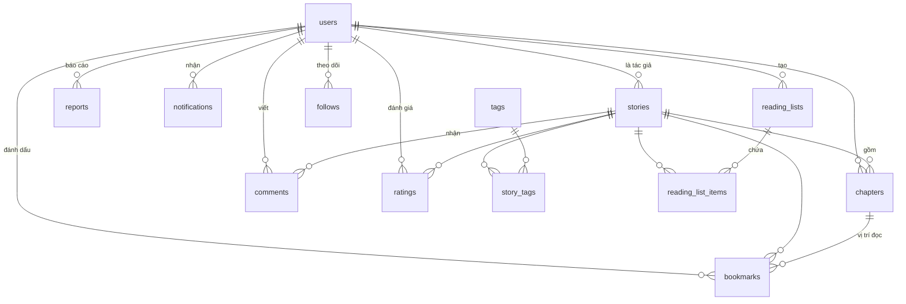

# Kế hoạch Database — Chuẩn hoá và Phi chuẩn hoá

Đi kèm [`ke-hoach-frontend.md`](ke-hoach-frontend.md).
Lược đồ hiện tại: [`../database/schema.sql`](../database/schema.sql).

**Tóm tắt:** 7 bảng hiện có → **13 bảng** khi làm hết chức năng đề xuất.
Thiết kế ở **3NF**, cộng **6 cột phi chuẩn hoá có chủ ý** để tránh đếm lại
mỗi lần tải trang.

---

## Phần 1 — Chuẩn hoá (Normalization)

### Ba dạng chuẩn, giải thích bằng chính dự án này

**1NF — mỗi ô chứa MỘT giá trị, không chứa danh sách**

```
❌ SAI                          ✅ ĐÚNG
stories                         stories        story_tags
+----+---------------------+    +----+       +----------+--------+
| id | tags                |    | id |       | story_id | tag_id |
| 1  | tien-hiep,phieu-luu |    | 1  |       | 1        | 1      |
+----+---------------------+    +----+       | 1        | 10     |
                                             +----------+--------+
```

Nhét chuỗi ngăn phẩy thì lọc phải `LIKE '%tien-hiep%'` — chậm, không dùng được
index, và **khớp nhầm**: `tien-hiep` khớp luôn cả `tien-hiep-hai-huoc`.

**2NF — cột không khoá phải phụ thuộc vào TOÀN BỘ khoá chính**

Bảng `bookmarks` có khoá chính ghép `(user_id, story_id)`. Nếu thêm cột
`story_title` vào đây thì sai 2NF — tiêu đề chỉ phụ thuộc `story_id`, không
phụ thuộc `user_id`. Tiêu đề thuộc về bảng `stories`, lấy ra bằng `JOIN`.

**3NF — cột không khoá không được phụ thuộc vào cột không khoá khác**

Bảng `chapters` không lưu `author_name`. Vì `author_name` phụ thuộc `story_id`
→ `author_id` → `username`, tức là phụ thuộc bắc cầu. Đổi tên tác giả mà phải
đi sửa hàng nghìn dòng `chapters` là dấu hiệu sai 3NF.

### Bảy bảng hiện có — kiểm tra 3NF

| Bảng | Khoá chính | Đạt 3NF? | Ghi chú |
|------|-----------|:--------:|---------|
| `users` | `id` | ✅ | |
| `stories` | `id` | ⚠️ | có 1 cột phi chuẩn hoá cố ý — xem Phần 3 |
| `chapters` | `id` | ✅ | `UNIQUE(story_id, chapter_no)` |
| `tags` | `id` | ✅ | |
| `story_tags` | `(story_id, tag_id)` | ✅ | bảng nối thuần |
| `comments` | `id` | ✅ | |
| `bookmarks` | `(user_id, story_id)` | ✅ | |

### Sáu bảng cần thêm cho chức năng đề xuất

| Bảng | Phục vụ | Khoá chính | Cột chính |
|------|---------|-----------|-----------|
| `ratings` | Đánh giá sao | `(user_id, story_id)` | `score` 1–5, `created_at` |
| `follows` | Theo dõi tác giả | `(follower_id, author_id)` | `created_at` |
| `notifications` | Báo chương mới | `id` | `user_id`, `type`, `story_id`, `chapter_id`, `is_read` |
| `reports` | Báo cáo vi phạm | `id` | `reporter_id`, `target_type`, `target_id`, `reason`, `status` |
| `reading_lists` | Tủ truyện cá nhân | `id` | `user_id`, `name`, `is_public` |
| `reading_list_items` | Truyện trong tủ | `(list_id, story_id)` | `position` |

**Vì sao `ratings` dùng khoá chính ghép `(user_id, story_id)`:**
Một người chỉ đánh giá một truyện **một lần**. Ràng buộc này để ở database chứ
không chỉ ở code — code có thể quên, database thì không. Đánh giá lại thì
`UPDATE`, không phải `INSERT` thêm dòng.

**Vì sao `reports` dùng `target_type` + `target_id` thay vì hai cột riêng:**
Báo cáo áp dụng cho cả truyện, chương lẫn bình luận. Tách ba cột `story_id`,
`chapter_id`, `comment_id` thì mỗi dòng luôn có hai cột NULL — vừa tốn chỗ vừa
khó truy vấn. Đánh đổi: **mất ràng buộc khoá ngoại**, phải tự kiểm trong code.
Ở quy mô đồ án thì đánh đổi này chấp nhận được.

---

## Phần 2 — Sơ đồ quan hệ đầy đủ (13 bảng)



`chapters` nối tới `users` qua nét đứt vì **không có khoá ngoại trực tiếp** —
tác giả của chương suy ra từ `stories.author_id`. Thêm cột `author_id` vào
`chapters` là vi phạm 3NF.

---

## Phần 3 — Phi chuẩn hoá có chủ ý (Denormalization)

### Vấn đề: trang danh sách chạy quá nhiều COUNT

Trang Kho truyện hiện 24 truyện. Mỗi thẻ cần: số chương, lượt xem, số bình
luận, điểm trung bình. Nếu tính đúng chuẩn hoá:

```sql
SELECT s.*,
  (SELECT COUNT(*) FROM chapters WHERE story_id = s.id)  AS chapter_count,
  (SELECT COUNT(*) FROM comments WHERE story_id = s.id)  AS comment_count,
  (SELECT AVG(score) FROM ratings WHERE story_id = s.id) AS avg_rating
FROM stories s LIMIT 24
```

→ **72 truy vấn con cho một lần tải trang.** Truyện càng nhiều chương, bình
luận càng nhiều thì càng chậm — và nó chậm dần theo thời gian, tới lúc phát
hiện thì đã khó sửa.

### Giải pháp: 6 cột đếm sẵn

| Bảng | Cột | Thay cho | Cập nhật khi |
|------|-----|----------|--------------|
| `stories` | `view_count` | đếm lượt xem | mở trang chi tiết |
| `stories` | `chapter_count` | `COUNT(chapters)` | thêm / xoá chương |
| `stories` | `comment_count` | `COUNT(comments)` | thêm / ẩn bình luận |
| `stories` | `rating_sum` | `SUM(ratings.score)` | thêm / sửa đánh giá |
| `stories` | `rating_count` | `COUNT(ratings)` | thêm / xoá đánh giá |
| `users` | `follower_count` | `COUNT(follows)` | theo dõi / bỏ theo dõi |

Điểm trung bình = `rating_sum / rating_count`. Lưu **hai cột thay vì một cột
trung bình** — vì cộng thêm một đánh giá mới chỉ cần `rating_sum + score` và
`rating_count + 1`, không phải tính lại từ đầu.

### Cái giá phải trả

**Dữ liệu có thể lệch.** Cột đếm là bản sao — sai một chỗ cập nhật là số hiển
thị sai vĩnh viễn. Ba biện pháp:

**1. Để DATABASE tự cộng, không đọc về Java rồi cộng**

```java
// ❌ SAI — hai người xem cùng lúc là MẤT một lượt (lost update)
int v = storyDAO.getViewCount(id);
storyDAO.setViewCount(id, v + 1);

// ✅ ĐÚNG — database cộng nguyên tử
"UPDATE stories SET view_count = view_count + 1 WHERE id = ?"
```

**2. Gói cùng transaction với thao tác gốc**

```java
con.setAutoCommit(false);
try {
    chapterDAO.insert(chapter);                    // thêm chương
    storyDAO.bumpChapterCount(storyId, +1);        // và tăng bộ đếm
    con.commit();                                  // cả hai, hoặc không cái nào
} catch (SQLException e) {
    con.rollback();
    throw e;
}
```
Thiếu transaction: thêm chương xong mà cập nhật bộ đếm lỗi → số chương sai mãi.

**3. Có câu lệnh đồng bộ lại khi nghi ngờ lệch**

```sql
UPDATE stories s SET
  chapter_count = (SELECT COUNT(*) FROM chapters WHERE story_id = s.id),
  comment_count = (SELECT COUNT(*) FROM comments
                   WHERE story_id = s.id AND status = 'VISIBLE');
```
Để trong `database/resync-counters.sql`. Chạy tay khi phát hiện số lệch.

### Nguyên tắc quyết định

> **Chỉ phi chuẩn hoá khi đã đo được là chậm, và chỉ cho dữ liệu ĐỌC NHIỀU
> GHI ÍT.**

| Trường hợp | Phi chuẩn hoá? | Vì sao |
|------------|:--------------:|--------|
| `chapter_count` | ✅ có | đọc mỗi lần tải trang, ghi khi thêm chương (hiếm) |
| `avg_rating` | ✅ có | đọc nhiều, ghi ít |
| `follower_count` | ✅ có | đọc nhiều, ghi ít |
| Tiêu đề truyện trong `bookmarks` | ❌ không | `JOIN` là đủ nhanh, và đổi tên truyện phải sửa nhiều dòng |
| Tên tác giả trong `chapters` | ❌ không | vi phạm 3NF, không được lợi gì |

---

## Phần 4 — Index

Cột nào hay xuất hiện trong `WHERE` hoặc `ORDER BY` thì cần index.

| Bảng | Index | Phục vụ truy vấn |
|------|-------|------------------|
| `stories` | `status` | lọc `WHERE status = 'PUBLISHED'` |
| `stories` | `author_id` | trang "Truyện của tôi" |
| `stories` | `updated_at` | sắp xếp mới cập nhật |
| `stories` | `view_count` | sắp xếp phổ biến |
| `chapters` | `(story_id, chapter_no)` UNIQUE | mục lục + chặn trùng số chương |
| `comments` | `(story_id, created_at)` | bình luận của truyện, mới nhất trước |
| `story_tags` | `tag_id` | lọc "tag này có truyện nào" |
| `ratings` | `story_id` | tính lại điểm khi đồng bộ |
| `notifications` | `(user_id, is_read)` | đếm thông báo chưa đọc |

**Đừng đánh index cho mọi cột.** Mỗi index làm `INSERT` và `UPDATE` chậm đi,
và tốn thêm dung lượng. Chỉ index cột thật sự dùng để lọc hoặc sắp xếp.

---

## Phần 5 — Kiểu dữ liệu, những chỗ dễ sai

| Cần lưu | Dùng | Đừng dùng | Vì sao |
|---------|------|-----------|--------|
| Nội dung chương | `MEDIUMTEXT` (16 MB) | ❌ `TEXT` | `TEXT` chỉ 64 KB — chương dài tiếng Việt vượt và MySQL **cắt cụt âm thầm** |
| Tiêu đề | `VARCHAR(200)` | `TEXT` | `VARCHAR` index được, `TEXT` thì không |
| Điểm đánh giá | `TINYINT` | `INT` | chỉ từ 1 đến 5 |
| Tổng điểm | `INT` | `TINYINT` | cộng dồn nghìn lượt là tràn |
| Ngày giờ | `DATETIME` | ❌ `TIMESTAMP` | `TIMESTAMP` chỉ tới năm 2038 và tự đổi theo múi giờ |
| Trạng thái | `ENUM(...)` | `VARCHAR` | database tự chặn giá trị sai |
| Bảng mã | `utf8mb4` | ❌ `utf8` | `utf8` của MySQL chỉ 3 byte — **không chứa được emoji** |

---

## Phần 6 — Thứ tự dựng bảng

Làm theo giai đoạn frontend, bảng nào cần trước thì dựng trước:

| Giai đoạn | Bảng | Cột đếm thêm vào |
|:---------:|------|------------------|
| **Đã xong** | 7 bảng gốc | `view_count` |
| **1** | `ratings` | `rating_sum`, `rating_count` vào `stories` |
| **2** | `follows` | `follower_count` vào `users` |
| **3** | `notifications` | — |
| **4** | `reports` | — |
| **5** | `reading_lists`, `reading_list_items` | — |

Mỗi giai đoạn một file `database/migration-N.sql` — **không sửa thẳng
`schema.sql`**. Vì `schema.sql` là bản dựng từ đầu cho máy trắng; migration là
bản vá cho database đã có dữ liệu. Trộn hai thứ là lúc cần chạy lại không biết
chạy cái nào.
