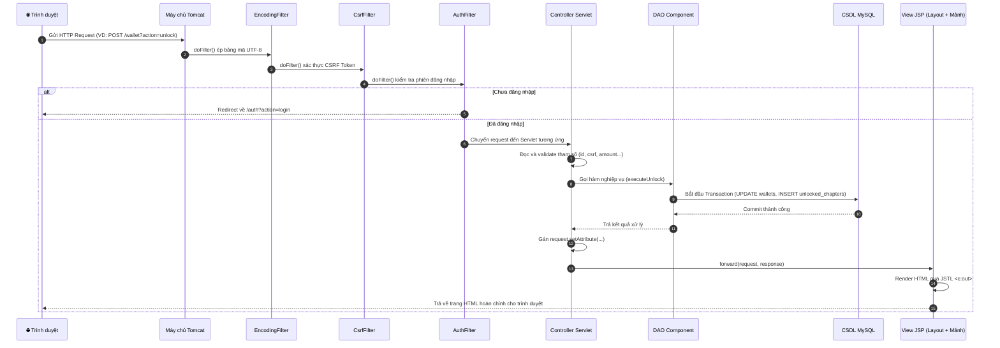
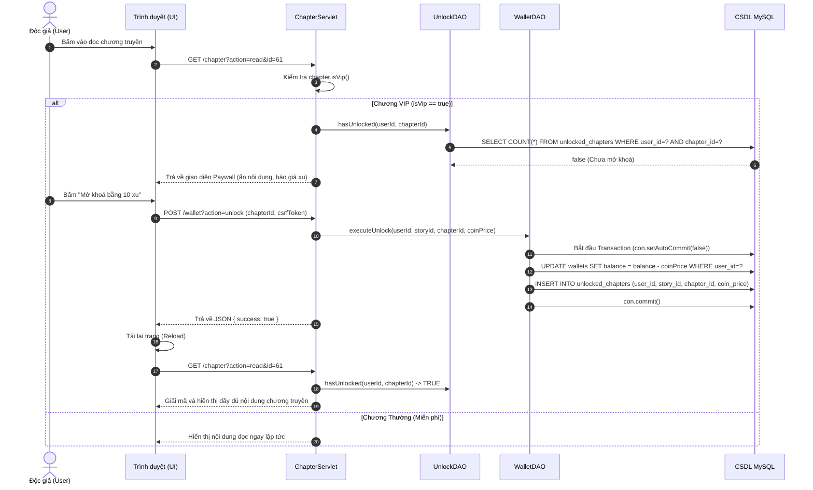
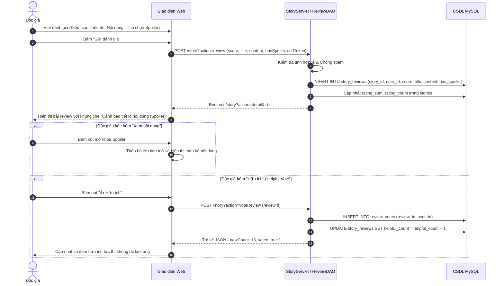
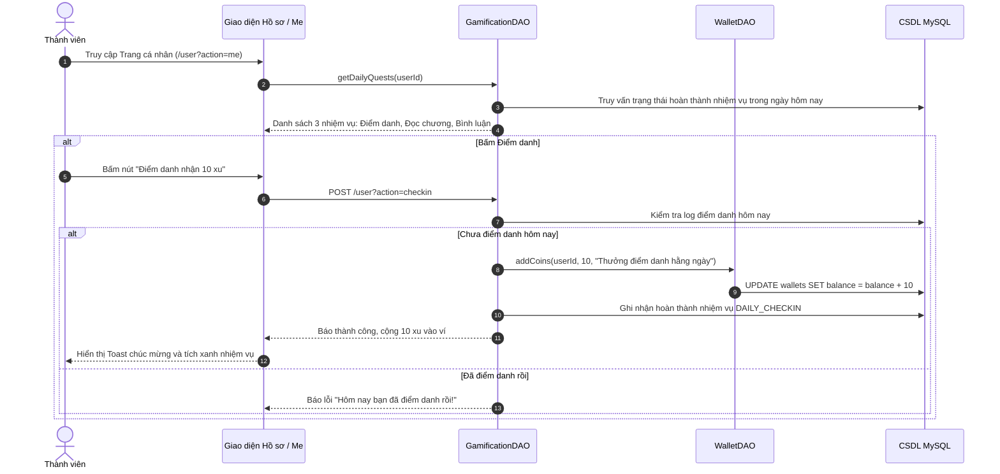
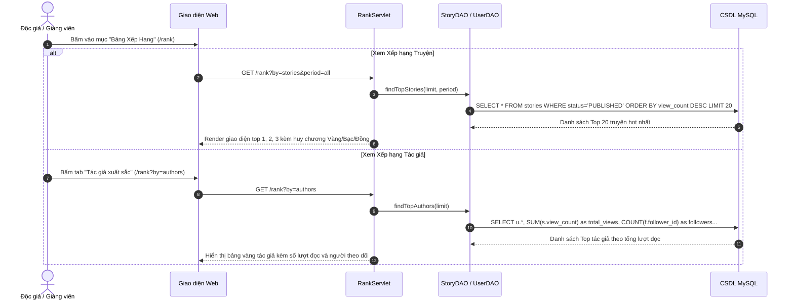
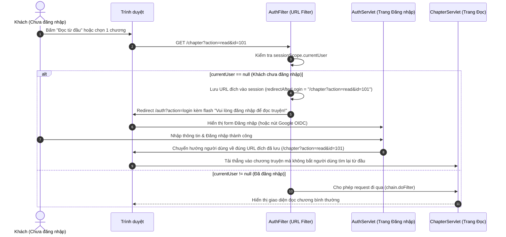
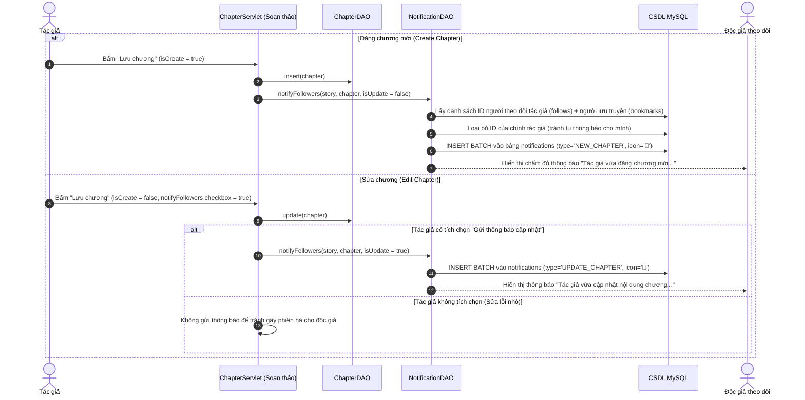
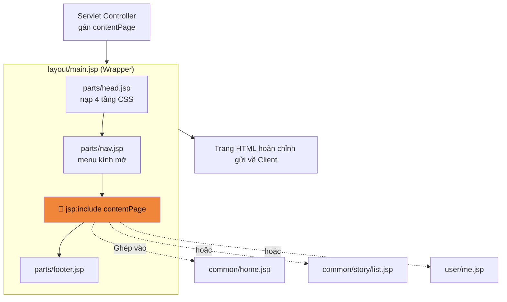
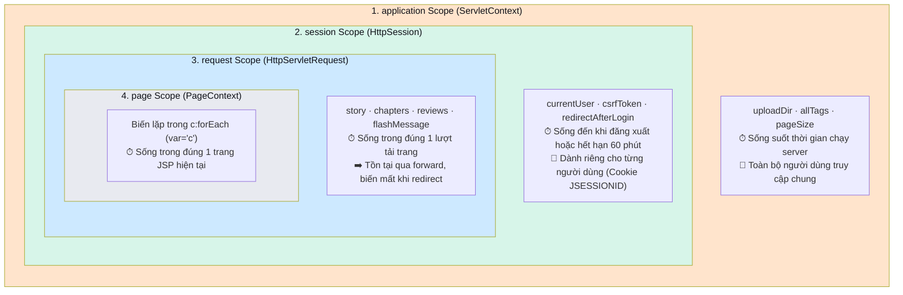
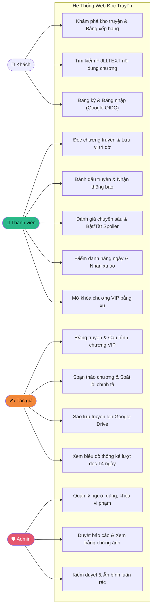

# 🗺️ SƠ ĐỒ KIẾN TRÚC & TUẦN TỰ HỆ THỐNG (SYSTEM DIAGRAMS)

> **Tài liệu tổng hợp toàn bộ sơ đồ phân tích thiết kế hệ thống bằng định dạng chuẩn Mermaid: ERD 18 bảng CSDL, Kiến trúc MVC Model 2, Vòng đời xử lý Request, 6 Sơ đồ Tuần tự (Sequence Diagrams) chuyên sâu và Sơ đồ Use Case phân quyền.**  
> Cập nhật: 2026-10-05 · **Phiên bản:** Hoàn thiện 25 Module Công nghệ Nâng cao (ISSUE-001 → ISSUE-026).

---

## 📑 MỤC LỤC
1. [ERD — Sơ đồ Thực thể Liên kết 18 Bảng CSDL](#1-erd--sơ-đồ-thực-thể-liên-kết-18-bảng-csdl)
2. [Kiến trúc Phân tầng MVC Model 2](#2-kiến-trúc-phân-tầng-mvc-model-2)
3. [Vòng đời Xử lý Yêu cầu (Request Lifecycle)](#3-vòng-đời-xử-lý-yêu-cầu-request-lifecycle)
4. [Hệ thống 6 Sơ đồ Tuần tự Chuyên sâu (Sequence Diagrams)](#4-hệ-thống-6-sơ-đồ-tuần-tự-chuyên-sâu-sequence-diagrams)
   - [4.1. Luồng Mở Khóa Chương VIP bằng Xu Ảo](#41-luồng-mở-khóa-chương-vip-bằng-xu-ảo)
   - [4.2. Luồng Đánh Giá Chuyên Sâu & Cảnh Báo Spoiler](#42-luồng-đánh-giá-chuyên-sâu--cảnh-báo-spoiler)
   - [4.3. Luồng Trò Chơi Hóa & Nhiệm Vụ Hằng Ngày](#43-luồng-trò-chơi-hóa--nhiệm-vụ-hằng-ngày)
   - [4.4. Luồng Bảng Xếp Hạng Truyện & Tác Giả](#44-luồng-bảng-xếp-hạng-truyện--tác-giả)
   - [4.5. Luồng Bắt Buộc Đăng Nhập khi Đọc Chương (Auth Guard)](#45-luồng-bắt-buộc-đăng-nhập-khi-đọc-chương-auth-guard)
   - [4.6. Luồng Thông Báo Tác Giả Xuất Bản & Cập Nhật Chương](#46-luồng-thông-báo-tác-giả-xuất-bản--cập-nhật-chương)
5. [Cơ chế Lắp ghép Giao diện (5 Layouts Architecture)](#5-cơ-chế-lắp-ghép-giao-diện-5-layouts-architecture)
6. [Vòng đời Dữ liệu theo Scope (Page, Request, Session, Application)](#6-vòng-đời-dữ-liệu-theo-scope-page-request-session-application)
7. [Sơ đồ Use Case Phân quyền Người dùng](#7-sơ-đồ-use-case-phân-quyền-người-dùng)

---

## 1. ERD — Sơ đồ Thực thể Liên kết 18 Bảng CSDL

```mermaid
erDiagram
    users {
        int id PK
        varchar username UK
        varchar email UK
        varchar password_hash
        varchar display_name
        varchar avatar_url
        enum role "USER|ADMIN"
        enum status "ACTIVE|BANNED"
        datetime created_at
    }
    user_identities {
        int id PK
        int user_id FK
        varchar provider "GOOGLE"
        varchar provider_uid UK
        varchar email
    }
    stories {
        int id PK
        varchar title
        varchar slug UK
        int author_id FK
        text description
        varchar cover_url
        enum status "DRAFT|PUBLISHED|DELETED"
        enum progress "ONGOING|COMPLETED"
        int view_count
        int rating_sum
        int rating_count
    }
    chapters {
        int id PK
        int story_id FK
        int chapter_no
        varchar title
        mediumtext content
        bool is_vip
        int coin_price
        datetime created_at
    }
    tags {
        int id PK
        varchar name UK
        varchar slug UK
        varchar description
    }
    story_tags {
        int story_id PK_FK
        int tag_id PK_FK
    }
    comments {
        int id PK
        int story_id FK
        int chapter_id FK "NULL được"
        int user_id FK
        int parent_id FK "NULL = cha"
        varchar content
        int likes_count
        enum status "VISIBLE|HIDDEN"
        datetime created_at
    }
    bookmarks {
        int user_id PK_FK
        int story_id PK_FK
        int last_chapter_id FK "NULL được"
        datetime updated_at
    }
    ratings {
        int user_id PK_FK
        int story_id PK_FK
        tinyint score "1..5"
        datetime updated_at
    }
    follows {
        int follower_id PK_FK
        int author_id PK_FK
        datetime created_at
    }
    notifications {
        int id PK
        int user_id FK "người nhận"
        int story_id FK "NULL được"
        int chapter_id FK "NULL được"
        varchar type "NEW_CHAPTER|UPDATE_CHAPTER|SYSTEM"
        varchar message
        bool is_read
        datetime created_at
    }
    reports {
        int id PK
        int reporter_id FK
        varchar target_type "STORY|COMMENT"
        int target_id "ID đối tượng"
        varchar category "8 loại vi phạm"
        varchar reason
        varchar status "PENDING|RESOLVED|DISMISSED"
        datetime created_at
    }
    report_evidence {
        int id PK
        int report_id FK
        varchar file_path
        datetime created_at
    }
    view_logs {
        bigint id PK
        int story_id FK
        int chapter_id FK "NULL được"
        int user_id FK "NULL = khách"
        varchar ip_address
        datetime viewed_at
    }
    wallets {
        int id PK
        int user_id FK_UK
        int balance "Số dư xu"
        int total_spent
        datetime updated_at
    }
    transactions {
        int id PK
        int sender_id FK
        int receiver_id FK
        int amount
        varchar type "TIP|UNLOCK|CHECKIN"
        varchar note
        datetime created_at
    }
    unlocked_chapters {
        int id PK
        int user_id FK
        int story_id FK
        int chapter_id FK
        int coin_price
        datetime unlocked_at
    }
    story_reviews {
        int id PK
        int story_id FK
        int user_id FK
        tinyint score "1..5"
        varchar title
        text content
        bool has_spoiler
        int helpful_count
        datetime created_at
    }
    review_votes {
        int review_id PK_FK
        int user_id PK_FK
        datetime voted_at
    }
    user_quests {
        int id PK
        int user_id FK
        varchar quest_key "DAILY_CHECKIN|READ|COMMENT"
        date quest_date
        bool completed
        datetime completed_at
    }

    users             ||--o{ stories            : "sáng tác"
    users             ||--o{ user_identities    : "liên kết OIDC"
    users             ||--o{ comments           : "bình luận"
    users             ||--o{ bookmarks          : "lưu truyện"
    users             ||--o{ ratings            : "chấm sao"
    users             ||--o{ follows            : "theo dõi"
    users             ||--o{ notifications      : "nhận thông báo"
    users             ||--o{ reports            : "báo cáo"
    users             ||--|| wallets            : "sở hữu ví xu"
    users             ||--o{ unlocked_chapters  : "mở khóa VIP"
    users             ||--o{ story_reviews      : "viết review"
    users             ||--o{ user_quests        : "làm nhiệm vụ"
    stories           ||--o{ chapters           : "có các chương"
    stories           ||--o{ story_tags         : "thuộc thể loại"
    tags              ||--o{ story_tags         : "gán cho truyện"
    stories           ||--o{ comments           : "chứa thảo luận"
    stories           ||--o{ story_reviews      : "nhận đánh giá"
    reports           ||--o{ report_evidence    : "đính kèm ảnh"
    story_reviews     ||--o{ review_votes       : "nhận bình chọn"
    chapters          ||--o{ unlocked_chapters  : "được mở khóa"
```

---

## 2. Kiến trúc Phân tầng MVC Model 2

Mũi tên chỉ hướng phụ thuộc một chiều từ trên xuống dưới — ngăn chặn tối đa việc rò rỉ logic giữa các tầng:

```mermaid
flowchart TD
    Client["🌐 Trình duyệt Độc giả / Tác giả"]

    subgraph Presentation ["1. TẦNG TRÌNH DIỄN (Web & Views)"]
        Filter["truyen.filter<br/>Auth · Admin · Csrf · Recaptcha · Encoding"]
        Ctrl["truyen.controller<br/>Servlet tiếp nhận request & điều hướng"]
        Views["WEB-INF/views/<br/>JSP Layouts & Content Partials (JSTL/EL)"]
        Assets["assets/<br/>CSS 4 tầng (Base, Components, Layouts) & JS"]
    end

    subgraph Business ["2. TẦNG THỰC THỂ & TIỆN ÍCH (Models & Utils)"]
        Models["truyen.model<br/>JavaBeans POJO chứa dữ liệu"]
        Utils["truyen.util<br/>PasswordUtil · RateLimiter · EpubWriter · DriveClient"]
    end

    subgraph DataAccess ["3. TẦNG TRUY CẬP DỮ LIỆU (DAOs)"]
        DAOs["truyen.dao<br/>PreparedStatements SQL nguyên tử & Connection Pool"]
    end

    subgraph Persistence ["4. TẦNG LƯU TRỮ CSDL"]
        MySQL[("MySQL 8.0 InnoDB<br/>utf8mb4_unicode_ci")]
    end

    Client -->|HTTP Request| Filter
    Filter -->|Cho phép qua| Ctrl
    Ctrl -->|Gọi truy vấn| DAOs
    DAOs -->|JDBC HikariCP| MySQL
    MySQL -->>|ResultSet| DAOs
    DAOs -.->|Trả thực thể| Models
    Ctrl -->|request.setAttribute| Views
    Views -.->|Đọc bằng EL| Models
    Views -->|Nạp style & script| Assets
    Views -->>|Render HTML| Client

    Ctrl -.->|Sử dụng| Utils
    DAOs -.->|Sử dụng| Utils

    style Ctrl fill:#f0863a,color:#1a0f06
    style DAOs fill:#2bb789,color:#04241a
    style Views fill:#8b7cf6,color:#fff
    style Models fill:#e8eaf0,color:#101219
```

---

## 3. Vòng đời Xử lý Yêu cầu (Request Lifecycle)



---

## 4. Hệ thống 6 Sơ đồ Tuần tự Chuyên sâu (Sequence Diagrams)

### 4.1. Luồng Mở Khóa Chương VIP bằng Xu Ảo
> 🖼️ *File sơ đồ hình ảnh đính kèm:* [`diagram_seq_vip.png`](diagrams/diagram_seq_vip.png)



---

### 4.2. Luồng Đánh Giá Chuyên Sâu & Cảnh Báo Spoiler
> 🖼️ *File sơ đồ hình ảnh đính kèm:* [`diagram_seq_review.png`](diagrams/diagram_seq_review.png)



---

### 4.3. Luồng Trò Chơi Hóa & Nhiệm Vụ Hằng Ngày
> 🖼️ *File sơ đồ hình ảnh đính kèm:* [`diagram_seq_gamification.png`](diagrams/diagram_seq_gamification.png)



---

### 4.4. Luồng Bảng Xếp Hạng Truyện & Tác Giả
> 🖼️ *File sơ đồ hình ảnh đính kèm:* [`diagram_seq_rank.png`](diagrams/diagram_seq_rank.png)



---

### 4.5. Luồng Bắt Buộc Đăng Nhập khi Đọc Chương (Auth Guard)



---

### 4.6. Luồng Thông Báo Tác Giả Xuất Bản & Cập Nhật Chương



---

## 5. Cơ chế Lắp ghép Giao diện (5 Layouts Architecture)



**Bảng quyết định sử dụng 5 Layouts:**
- `main.jsp`: Khung mặc định có Nav + Footer (Trang chủ, Kho truyện, Bảng xếp hạng, Hồ sơ).
- `auth.jsp`: Khung thẻ căn giữa màn hình, không Nav (Đăng nhập, Đăng ký, Quên mật khẩu).
- `reader.jsp`: Khung đọc truyện chuyên biệt toàn màn hình, thanh công cụ font/cỡ chữ, chống mỏi mắt.
- `editor.jsp`: Khung sáng tác chương truyện văn học, đếm từ trực tiếp, phím tắt văn học.
- `admin.jsp`: Khung quản trị có Sidebar bên trái và bảng số liệu.

---

## 6. Vòng đời Dữ liệu theo Scope (Page, Request, Session, Application)



---

## 7. Sơ đồ Use Case Phân quyền Người dùng



---

## 8. Cách Xuất Bản Sơ Đồ để Thuyết Minh Đồ Án
1. **Dùng các file ảnh vẽ sẵn:** Xem tại thư mục `docs/diagrams/` (`diagram_seq_vip.png`, `diagram_seq_review.png`, `diagram_seq_gamification.png`, `diagram_seq_rank.png`).
2. **Xem trực tiếp trên GitHub / Markdown Preview:** GitHub tự động biên dịch toàn bộ các khối mã Mermaid trên thành biểu đồ tương tác sắc nét.
3. **Chỉnh sửa / Xuất độ phân giải cao:** Truy cập [Mermaid Live Editor](https://mermaid.live), sao chép mã biểu đồ và xuất dưới định dạng SVG/PNG sắc nét phục vụ in báo cáo đồ án.
