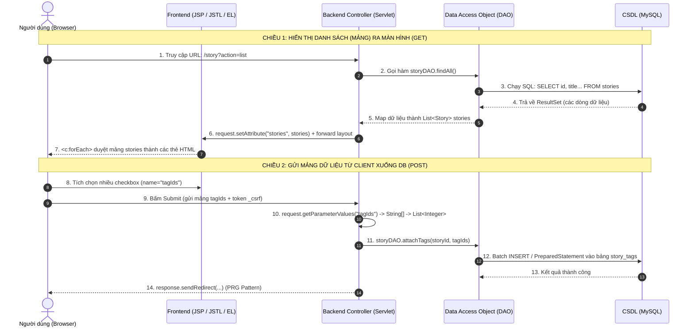

# 🧭 Bản đồ trực quan: Luồng Code tính năng mới từ Frontend ➔ Backend ➔ Database

Tài liệu này giải thích chi tiết, trực quan hóa từng bước và liệt kê rõ ràng **mọi ký hiệu cần dùng** khi bạn muốn hiện thực một tính năng mới trong dự án (đặc biệt là thao tác với **danh sách / mảng dữ liệu**).

---

## 🗺️ 1. Sơ đồ toàn cảnh (Visual Architecture Flow)

Luồng hoạt động trong đồ án gồm 2 chiều chính:
1. **Chiều Đọc (Render)**: Database ➔ DAO ➔ Servlet ➔ Đẩy mảng lên JSP render ra giao diện.
2. **Chiều Ghi (Submit)**: Người dùng chọn mảng (checkbox/select/JS) ➔ Gửi form POST ➔ Servlet hứng ➔ DAO lưu xuống Database.



---

## 🔣 2. Bảng giải mã: "Frontend cần dùng ký hiệu gì?"

Khi code ở tầng View (`.jsp`) và JavaScript, bạn sẽ gặp các ký hiệu sau:

| Ký hiệu / Cú pháp | Thuộc về | Ý nghĩa & Tác dụng | Ví dụ thực tế |
|---|---|---|---|
| `<%@ taglib prefix="c" ... %>` | **JSTL Core** | Khai báo thư viện thẻ chuẩn JSTL (cần đặt ở đầu file) | `<%@ taglib prefix="c" uri="http://java.sun.com/jsp/jstl/core" %>` |
| `<%@ taglib prefix="fmt" ... %>` | **JSTL Fmt** | Khai báo thư viện định dạng số, ngày tháng, tiền tệ | `<%@ taglib prefix="fmt" uri="http://java.sun.com/jsp/jstl/fmt" %>` |
| `${biến}` | **EL (Expression)** | Lấy giá trị của biến được Controller nạp vào request/session | `<p>${story.title}</p>` |
| `${obj.field}` | **EL (Property)** | Tự động gọi hàm getter tương ứng (ví dụ `story.getTitle()`) | `<span>${user.displayName}</span>` |
| `<c:out value="${...}"/>` | **JSTL c:out** | **In chuỗi an toàn chống hack XSS** (mã hóa ký tự `< > " ' &`) | `<c:out value="${comment.content}"/>` |
| `<c:forEach items="${...}">` | **JSTL Vòng lặp** | Duyệt qua từng phần tử của mảng / List / Collection | `<c:forEach var="item" items="${stories}">` |
| `varStatus="status"` | **Thuộc tính lặp** | Đếm vị trí dòng trong vòng lặp (`.index` từ 0, `.count` từ 1) | `<span>Top ${status.count}</span>` |
| `<c:if test="${...}">` | **JSTL Rẽ nhánh** | Kiểm tra điều kiện (hiển thị khi `true`) | `<c:if test="${not empty stories}">` |
| `<c:choose>` / `<c:when>` | **JSTL Switch-case**| Rẽ nhánh nhiều điều kiện (Nếu ... Ngược lại) | `<c:choose><c:when>...<c:otherwise>` |
| `name="tagIds"` *(ở nhiều ô input)* | **HTML Form Array**| Thuộc tính gom nhiều input thành 1 mảng khi gửi về server | `<input type="checkbox" name="tagIds" value="1">` |
| `data-id="${item.id}"` | **HTML5 Dataset** | Nhúng dữ liệu từ backend vào HTML để JavaScript đọc an toàn | `<div class="card" data-id="${story.id}">` |
| `${pageContext.request.contextPath}` | **EL URL Base** | Lấy đường dẫn gốc của website (tránh sai link khi deploy) | `<a href="${pageContext.request.contextPath}/home">` |
| `${sessionScope.csrfToken}` | **CSRF Token** | Mã bảo mật bắt buộc trong mọi form POST | `<input type="hidden" name="_csrf" value="${sessionScope.csrfToken}">` |

---

## 🛠️ 3. Quy trình 5 bước code tính năng mới (Có xử lý mảng)

Giả sử ta muốn làm tính năng: **"Hiển thị danh sách Thể loại truyện (Tags) và cho phép người dùng tick chọn nhiều thể loại để lọc / gán"**.

```text
[Bước 1: DB]       Tạo bảng / câu truy vấn SQL
       │
[Bước 2: Model]    Tạo lớp Java Bean chứa dữ liệu (Tag.java)
       │
[Bước 3: DAO]      Viết hàm query lấy List<Tag> và lưu mảng tagIds (TagDAO.java)
       │
[Bước 4: Servlet]  Bắt request, gọi DAO, nạp setAttribute, xử lý form POST (TagServlet.java)
       │
[Bước 5: JSP & UI] Viết giao diện với <c:forEach>, input checkbox, JS gom mảng (tags.jsp)
```

---

### Bước 1: Database (Tạo bảng & Truy vấn)

Tạo file migration trong thư mục `database/` (ví dụ `database/migration-009-tags.sql`):

```sql
-- 1. Bảng lưu thể loại
CREATE TABLE IF NOT EXISTS tags (
    id INT AUTO_INCREMENT PRIMARY KEY,
    name VARCHAR(100) NOT NULL UNIQUE,
    slug VARCHAR(100) NOT NULL UNIQUE,
    created_at TIMESTAMP DEFAULT CURRENT_TIMESTAMP
);

-- 2. Dữ liệu mẫu
INSERT INTO tags (name, slug) VALUES 
('Tiên Hiệp', 'tien-hiep'),
('Kiếm Hiệp', 'kiem-hiep'),
('Ngôn Tình', 'ngon-tinh'),
('Huyền Huyễn', 'huyen-huyen');
```

---

### Bước 2: Model (Java Bean đại diện 1 dòng dữ liệu)

Tạo class trong package `truyen.model`:

```java
package truyen.model;

import java.io.Serializable;
import java.sql.Timestamp;

public class Tag implements Serializable {
    private int id;
    private String name;
    private String slug;
    private Timestamp createdAt;

    public Tag() {}

    // Getters và Setters (BẮT BUỘC có để JSP đọc được qua EL ${tag.name})
    public int getId() { return id; }
    public void setId(int id) { this.id = id; }

    public String getName() { return name; }
    public void setName(String name) { this.name = name; }

    public String getSlug() { return slug; }
    public void setSlug(String slug) { this.slug = slug; }

    public Timestamp getCreatedAt() { return createdAt; }
    public void setCreatedAt(Timestamp createdAt) { this.createdAt = createdAt; }
}
```

---

### Bước 3: DAO (Truy vấn CSDL & Trả về List/Mảng)

Tạo class trong package `truyen.dao`:

```java
package truyen.dao;

import truyen.model.Tag;
import truyen.util.DBConnection;

import java.sql.*;
import java.util.ArrayList;
import java.util.List;

public class TagDAO {

    // 1. LẤY MẢNG: Trả về danh sách tất cả các tag
    public List<Tag> findAll() throws SQLException {
        List<Tag> list = new ArrayList<>();
        String sql = "SELECT id, name, slug, created_at FROM tags ORDER BY name ASC";

        try (Connection conn = DBConnection.getConnection();
             PreparedStatement ps = conn.prepareStatement(sql);
             ResultSet rs = ps.executeQuery()) {

            while (rs.next()) {
                Tag tag = new Tag();
                tag.setId(rs.getInt("id"));
                tag.setName(rs.getString("name"));
                tag.setSlug(rs.getString("slug"));
                tag.setCreatedAt(rs.getTimestamp("created_at"));
                list.add(tag); // Thêm từng phần tử vào mảng/list
            }
        }
        return list;
    }

    // 2. LƯU MẢNG: Nhận vào 1 mảng ID và lưu quan hệ vào database
    public void saveStoryTags(int storyId, List<Integer> tagIds) throws SQLException {
        String deleteSql = "DELETE FROM story_tags WHERE story_id = ?";
        String insertSql = "INSERT INTO story_tags (story_id, tag_id) VALUES (?, ?)";

        try (Connection conn = DBConnection.getConnection()) {
            conn.setAutoCommit(false); // Bật transaction để bảo đảm an toàn dữ liệu
            try {
                // Xoá tag cũ
                try (PreparedStatement psDel = conn.prepareStatement(deleteSql)) {
                    psDel.setInt(1, storyId);
                    psDel.executeUpdate();
                }

                // Chèn mảng tag mới
                if (tagIds != null && !tagIds.isEmpty()) {
                    try (PreparedStatement psIns = conn.prepareStatement(insertSql)) {
                        for (Integer tagId : tagIds) {
                            psIns.setInt(1, storyId);
                            psIns.setInt(2, tagId);
                            psIns.addBatch(); // Gom lệnh thành mảng batch
                        }
                        psIns.executeBatch(); // Thực thi cả mảng 1 lần (tối ưu hiệu năng)
                    }
                }
                conn.commit();
            } catch (SQLException e) {
                conn.rollback();
                throw e;
            }
        }
    }
}
```

---

### Bước 4: Servlet Controller (Điều phối & Nhận/Gửi mảng)

Tạo class trong package `truyen.controller`:

```java
package truyen.controller;

import truyen.dao.TagDAO;
import truyen.model.Tag;

import javax.servlet.ServletException;
import javax.servlet.annotation.WebServlet;
import javax.servlet.http.HttpServlet;
import javax.servlet.http.HttpServletRequest;
import javax.servlet.http.HttpServletResponse;
import java.io.IOException;
import java.sql.SQLException;
import java.util.ArrayList;
import java.util.Collections;
import java.util.List;

@WebServlet("/tags")
public class TagServlet extends HttpServlet {
    private TagDAO tagDAO;

    @Override
    public void init() {
        tagDAO = new TagDAO();
    }

    // CHIỀU GET: Lấy mảng từ DAO và gửi sang JSP hiển thị
    @Override
    protected void doGet(HttpServletRequest request, HttpServletResponse response)
            throws ServletException, IOException {
        try {
            List<Tag> tags = tagDAO.findAll();

            // ĐẨY MẢNG VÀO REQUEST SCOPE
            request.setAttribute("tags", tags);
            request.setAttribute("pageTitle", "Danh mục thể loại");
            request.setAttribute("contentPage", "/WEB-INF/views/common/tags.jsp");

        } catch (SQLException e) {
            log("Lỗi tải danh mục tags", e);
            request.setAttribute("tags", Collections.emptyList()); // Đưa mảng rỗng để JSP không lỗi
            request.setAttribute("message", "Không thể tải danh sách thể loại.");
            request.setAttribute("contentPage", "/WEB-INF/views/common/tags.jsp");
        }

        // Chuyển tiếp tới layout chính
        getServletContext()
            .getRequestDispatcher("/WEB-INF/views/layout/main.jsp")
            .forward(request, response);
    }

    // CHIỀU POST: Nhận mảng do người dùng tick trên UI gửi lên
    @Override
    protected void doPost(HttpServletRequest request, HttpServletResponse response)
            throws ServletException, IOException {

        // Lấy storyId đơn
        int storyId = Integer.parseInt(request.getParameter("storyId"));

        // LẤY MẢNG: getParameterValues trả về mảng String[] các checkbox được tick
        String[] rawTagIds = request.getParameterValues("tagIds");
        List<Integer> tagIds = new ArrayList<>();

        if (rawTagIds != null) {
            for (String str : rawTagIds) {
                try {
                    tagIds.add(Integer.parseInt(str.trim()));
                } catch (NumberFormatException ignored) {}
            }
        }

        try {
            // Lưu mảng xuống database
            tagDAO.saveStoryTags(storyId, tagIds);
            request.getSession().setAttribute("flashSuccess", "Cập nhật thể loại thành công!");
        } catch (SQLException e) {
            log("Lỗi cập nhật tag", e);
            request.getSession().setAttribute("flashError", "Có lỗi xảy ra khi lưu thể loại.");
        }

        // Redirect theo chuẩn PRG (Post-Redirect-Get)
        response.sendRedirect(request.getContextPath() + "/tags");
    }
}
```

---

### Bước 5: JSP & Frontend (Cách viết ký hiệu trên giao diện)

Tạo file view `src/main/webapp/WEB-INF/views/common/tags.jsp`:

```jsp
<%@ page contentType="text/html; charset=UTF-8" pageEncoding="UTF-8" %>
<%@ taglib prefix="c" uri="http://java.sun.com/jsp/jstl/core" %>
<%@ taglib prefix="fmt" uri="http://java.sun.com/jsp/jstl/fmt" %>

<div class="container my-4">
    <h2><c:out value="${pageTitle}"/></h2>

    <!-- Form chứa mảng checkbox gửi về backend -->
    <form action="${pageContext.request.contextPath}/tags" method="post">
        <!-- Token bảo vệ CSRF bắt buộc -->
        <input type="hidden" name="_csrf" value="${sessionScope.csrfToken}">
        <input type="hidden" name="storyId" value="1">

        <!-- Kiểm tra mảng có dữ liệu hay rỗng -->
        <c:choose>
            <c:when test="${not empty tags}">
                <div class="row row-cols-2 row-cols-md-4 g-3 mb-4">
                    <!-- KÝ HIỆU DUYỆT MẢNG: c:forEach -->
                    <c:forEach var="tag" items="${tags}" varStatus="status">
                        <div class="col">
                            <div class="form-check tag-card" data-id="${tag.id}" data-slug="${tag.slug}">
                                <!-- Thuộc tính name="tagIds" chung tên để tạo thành mảng -->
                                <input class="form-check-input tag-checkbox" 
                                       type="checkbox" 
                                       name="tagIds" 
                                       value="${tag.id}" 
                                       id="tag_${tag.id}">
                                
                                <label class="form-check-label" for="tag_${tag.id}">
                                    <span class="badge bg-secondary me-1">#${status.count}</span>
                                    <strong><c:out value="${tag.name}"/></strong>
                                </label>
                            </div>
                        </div>
                    </c:forEach>
                </div>
            </c:when>
            <c:otherwise>
                <div class="alert alert-warning">Chưa có thể loại nào trong hệ thống.</div>
            </c:otherwise>
        </c:choose>

        <button type="submit" class="btn btn-primary">Lưu lựa chọn</button>
        <button type="button" id="btnSelectAll" class="btn btn-outline-secondary ms-2">Chọn tất cả</button>
    </form>
</div>

<!-- ĐƯA DỮ LIỆU MẢNG SANG JAVASCRIPT Ở TRÌNH DUYỆT -->
<script>
    document.addEventListener("DOMContentLoaded", function () {
        // 1. Chuyển đổi các phần tử DOM thành Mảng JavaScript (Array of Objects)
        const tagElements = document.querySelectorAll('.tag-card');
        const tagArray = Array.from(tagElements).map(el => ({
            id: parseInt(el.dataset.id),
            slug: el.dataset.slug,
            name: el.querySelector('strong').innerText
        }));

        console.log("Mảng Javascript lấy từ giao diện:", tagArray);

        // 2. Xử lý nút 'Chọn tất cả' bằng Javascript
        const btnSelectAll = document.getElementById('btnSelectAll');
        btnSelectAll.addEventListener('click', function () {
            const checkboxes = document.querySelectorAll('.tag-checkbox');
            const shouldCheck = !checkboxes[0].checked;
            checkboxes.forEach(cb => cb.checked = shouldCheck);
            btnSelectAll.innerText = shouldCheck ? 'Bỏ chọn tất cả' : 'Chọn tất cả';
        });
    });
</script>
```

---

## 📊 4. Bảng ánh xạ tổng kết (Mapping Cheat-sheet)

Đối chiếu xem một dữ liệu sẽ mang tên gì và hình dạng ra sao ở từng trạm:

| Khái niệm | Ở Database (MySQL) | Ở Backend Model (Java) | Ở DAO (JDBC) | Ở Servlet (Controller) | Ở Frontend (JSP / EL) | Ở Trình duyệt (JS) |
|---|---|---|---|---|---|---|
| **Cột dữ liệu đơn** | `name VARCHAR(100)` | `private String name;` | `rs.getString("name")` | `request.getParameter("name")` | `${tag.name}` hoặc `<c:out value="${tag.name}"/>` | `el.dataset.name` |
| **Khóa chính ID** | `id INT PK` | `private int id;` | `rs.getInt("id")` | `Integer.parseInt(request.getParameter("id"))` | `${tag.id}` | `parseInt(el.dataset.id)` |
| **Danh sách / Mảng**| Bảng `tags` (nhiều dòng) | `List<Tag>` | `List<Tag> list = new ArrayList<>()` | `request.setAttribute("tags", list)` | `<c:forEach items="${tags}" var="tag">` | `const tagArray = [...]` |
| **Mảng gửi từ Form**| Bảng quan hệ N-N | `List<Integer> tagIds` | Loop `ps.addBatch()` | `request.getParameterValues("tagIds")` | `<input type="checkbox" name="tagIds" value="${tag.id}">` | Gom qua `querySelectorAll` |

---

## ⚠️ 5. Ba lỗi "kinh điển" cần tránh khi làm việc với mảng

1. **Quên `emptyList()` khi rỗng/lỗi**:
   - Nếu trong Servlet bạn gán `request.setAttribute("items", null)`, khi sang JSP vòng lặp `<c:forEach>` có thể gây lỗi hoặc không chạy đúng. 
   - **Cách chuẩn**: Nếu không có dữ liệu, hãy trả về `Collections.emptyList()`.

2. **Dùng nhầm `getParameter` thay vì `getParameterValues`**:
   - Nếu có nhiều checkbox cùng `name="ids"`, gọi `request.getParameter("ids")` sẽ **chỉ lấy được duy nhất 1 giá trị đầu tiên**!
   - **Bắt buộc**: Dùng `request.getParameterValues("ids")` để nhận về mảng đầy đủ `String[]`.

3. **In trực tiếp dữ liệu dạng chuỗi mà không dùng `<c:out>`**:
   - Viết `${item.name}` nếu người dùng nhập tên chứa mã độc `<script>` thì website sẽ bị tấn công XSS.
   - **Luật an toàn**: Luôn bọc trong `<c:out value="${item.name}"/>`.
