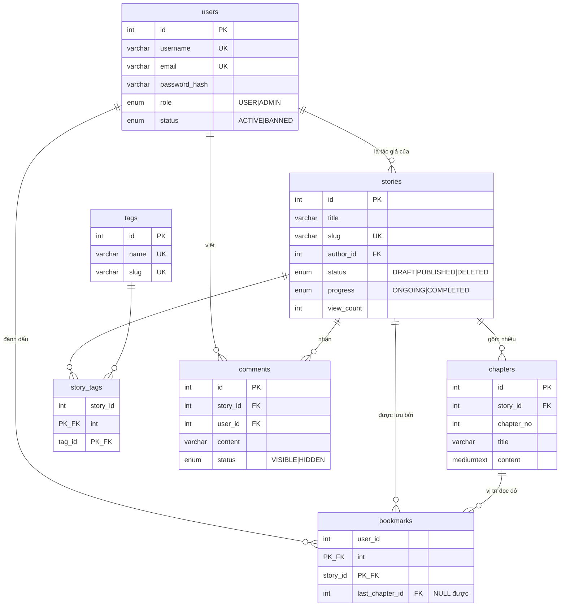
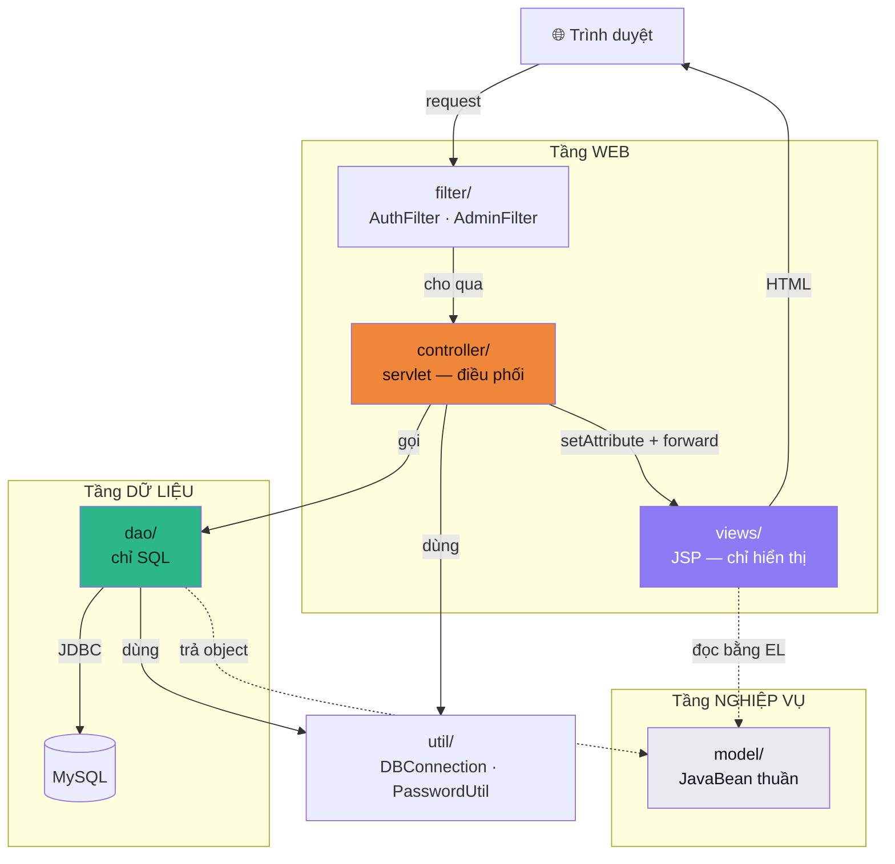
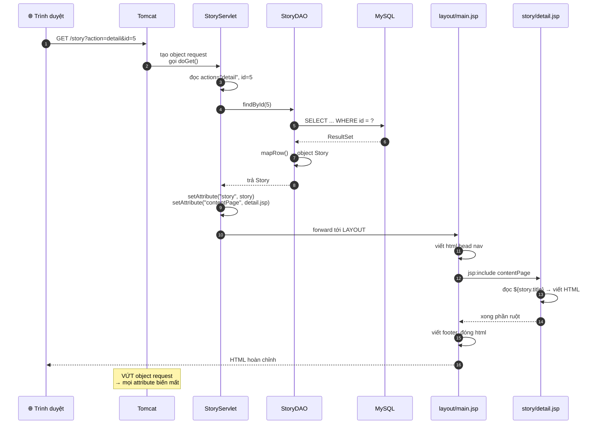
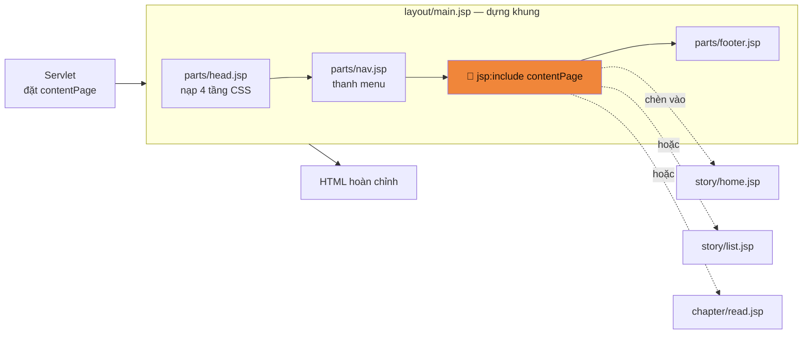
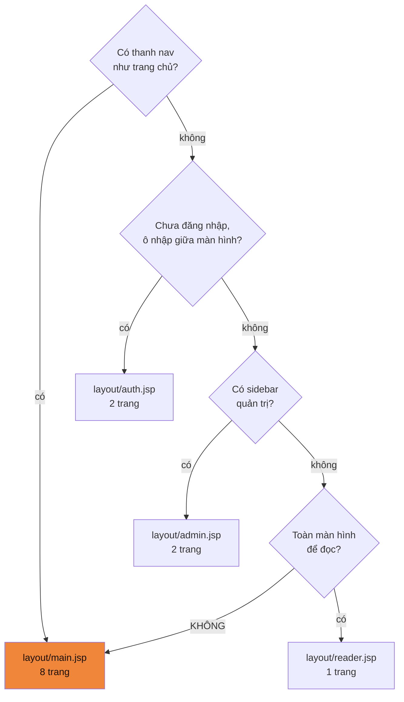
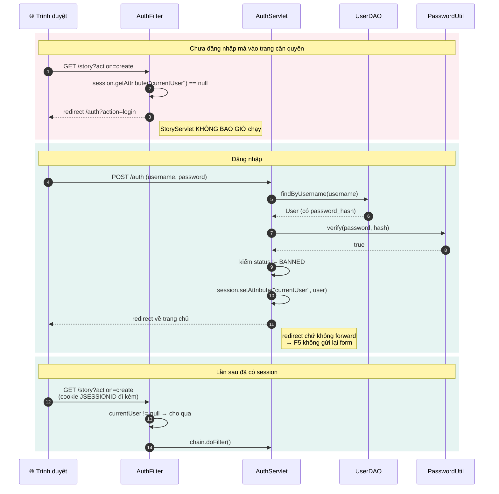
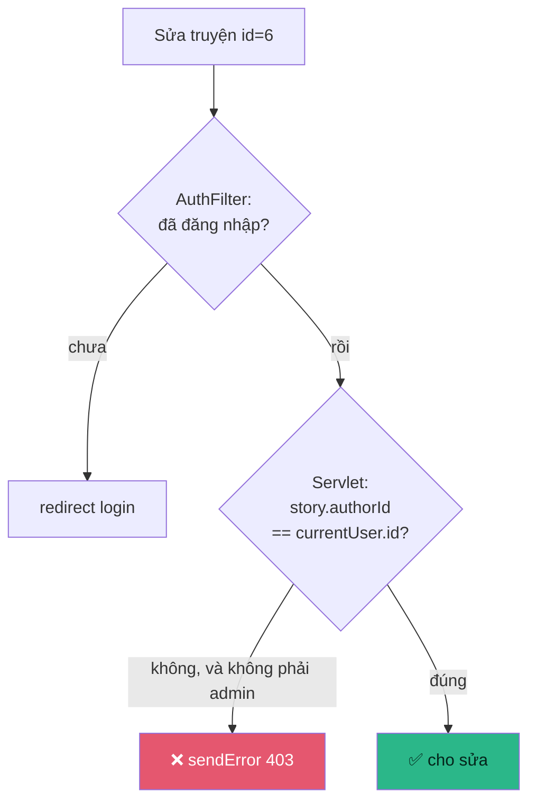
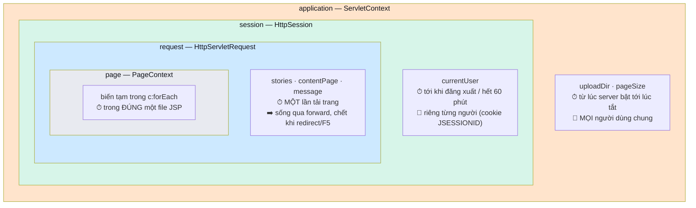
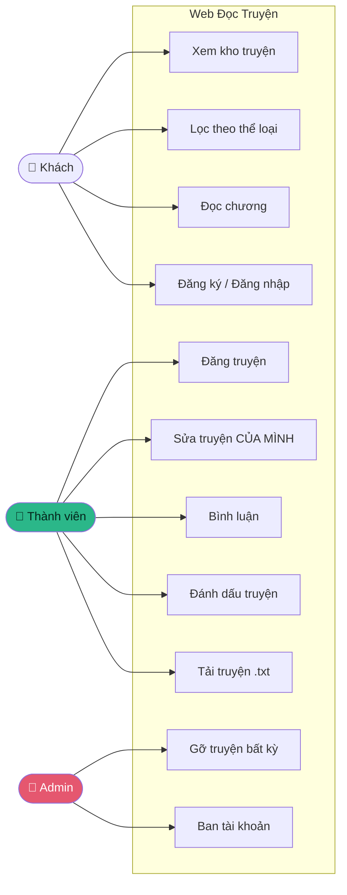

# 🗺️ Sơ đồ hệ thống

Sơ đồ vẽ bằng **Mermaid** — GitHub tự render, không cần cài gì.
Muốn xem trong VS Code thì cài extension *Markdown Preview Mermaid Support*.

**Mục lục**
1. [ERD — 7 bảng](#1-erd--quan-hệ-7-bảng)
2. [Kiến trúc 4 tầng](#2-kiến-trúc-4-tầng)
3. [Luồng MVC — một request đi qua đâu](#3-luồng-mvc--một-request-đi-qua-đâu)
4. [Layout lắp trang thế nào](#4-layout-lắp-trang-thế-nào)
5. [Luồng đăng nhập + Filter](#5-luồng-đăng-nhập--filter)
6. [Vòng đời dữ liệu theo scope](#6-vòng-đời-dữ-liệu-theo-scope)
7. [Sơ đồ use case](#7-sơ-đồ-use-case)

---

## 1. ERD — quan hệ 7 bảng

**Ba điểm đáng chú ý:**

| Điểm | Giải thích |
|------|-----------|
| Không có bảng `authors` | "Tác giả" là **quan hệ** `stories.author_id`, không phải loại người. Cùng tài khoản vừa viết truyện A vừa đọc truyện B |
| `story_tags` là bảng nối | Quan hệ **nhiều–nhiều** bắt buộc phải có bảng nối. Khoá chính gồm 2 cột |
| `bookmarks.last_chapter_id` cho phép NULL | Đã lưu nhưng chưa đọc chương nào. Xoá chương thì `SET NULL`, bookmark **vẫn còn** |

---

## 2. Kiến trúc 4 tầng

Mũi tên chỉ **hướng phụ thuộc** — luôn đi xuống, không bao giờ ngược lên.

**Luật đọc sơ đồ này:**

- `dao/` **không có mũi tên nào chỉ lên** `controller/` hay `views/` — DAO không biết web tồn tại
- `views/` **không có mũi tên** tới `dao/` — JSP không được truy vấn database
- `model/` là thứ duy nhất **cả hai tầng cùng chạm** — nó là ngôn ngữ chung

**Phép thử:** đổi MySQL → PostgreSQL thì chỉ hộp `dao/` đổi. Nếu phải sửa chỗ khác, tầng đã bị rò.

---

## 3. Luồng MVC — một request đi qua đâu

Ví dụ: người dùng bấm vào một truyện.

**Ba điều rút ra:**

| Bước | Ý nghĩa |
|:----:|---------|
| 5–7 | Chỗ **duy nhất** chạm database. Đổi hệ quản trị chỉ sửa ở đây |
| 9 | Chỗ **duy nhất** nối hai thế giới: DAO trả object Java → servlet cất vào request |
| Cuối | Lý do request scope chết sau **mỗi** lần tải trang |

**Chú ý bước 10:** servlet forward tới **layout**, không phải tới `detail.jsp`. Layout mới là thứ được chạy, nó gọi trang nội dung vào giữa.

---

## 4. Layout lắp trang thế nào

**4 layout, không phải 25:**

Nhánh cuối quan trọng nhất: **không rơi vào đâu thì dùng `main`**, không phải "tạo layout mới cho chắc".

---

## 5. Luồng đăng nhập + Filter

**Filter KHÔNG thay được kiểm tra quyền sở hữu:**

Filter chỉ biết *"đã đăng nhập chưa"*. Nó **không biết** truyện id=6 là của ai. Thiếu ô màu đỏ thì sửa `?id=5` thành `?id=6` là sửa được truyện người khác.

---

## 6. Vòng đời dữ liệu theo scope

**Càng ra ngoài, sống càng lâu và càng nhiều người thấy.**

`${dem}` không ghi rõ scope → EL tìm từ **trong ra ngoài**: page → request → session → application, gặp trước lấy trước. Đó là lý do người đăng nhập đặt tên `currentUser` chứ không phải `user` — tránh đụng với `user` ai đó lỡ đặt ở request.

Giải thích đầy đủ: [`giai-thich.md`](giai-thich.md) khu 1.

---

## 7. Sơ đồ use case

**Phân quyền cộng dồn:** Thành viên làm được mọi thứ của Khách. Admin làm được mọi thứ của Thành viên.

Ô **"Sửa truyện CỦA MÌNH"** là chỗ cần kiểm quyền sở hữu, không chỉ kiểm vai trò.

---

## Cách xuất sơ đồ ra ảnh để dán vào báo cáo

Mermaid không dán thẳng vào Word được. Ba cách:

| Cách | Làm sao |
|------|---------|
| **Nhanh nhất** | Mở file này trên GitHub → chuột phải vào sơ đồ → Lưu ảnh |
| **Chất lượng cao** | <https://mermaid.live> → dán code → Actions → PNG/SVG |
| **Trong VS Code** | Cài *Markdown Preview Mermaid Support* → xem trước → chụp màn hình |
